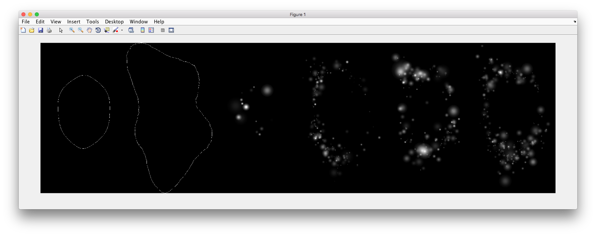
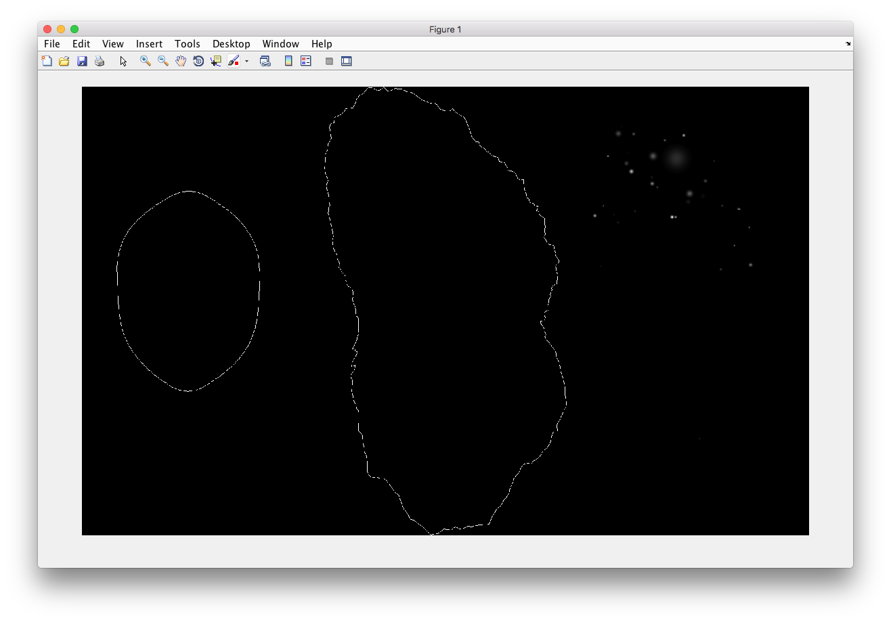
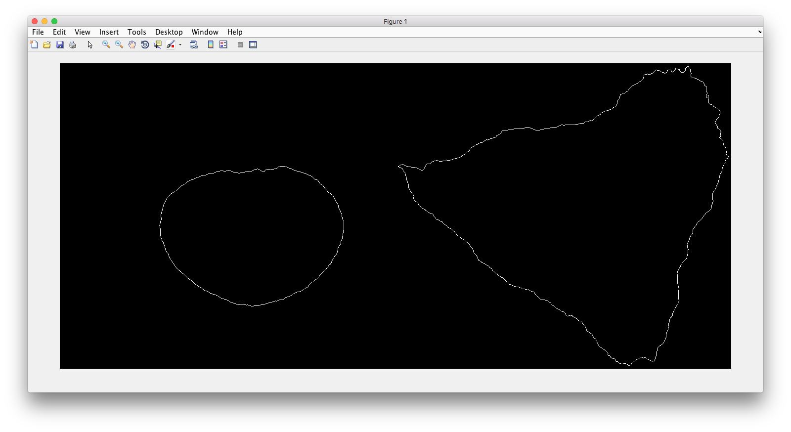
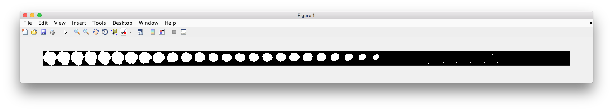
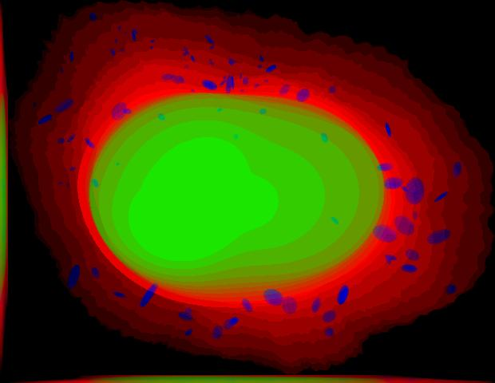
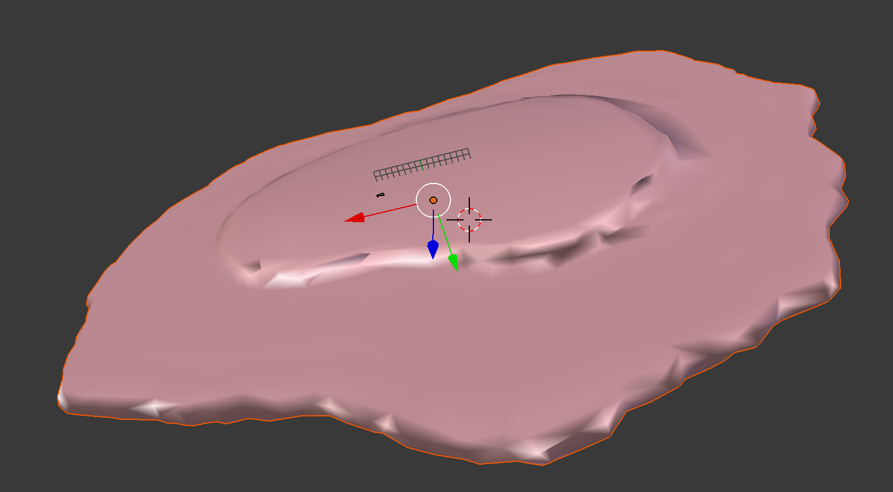
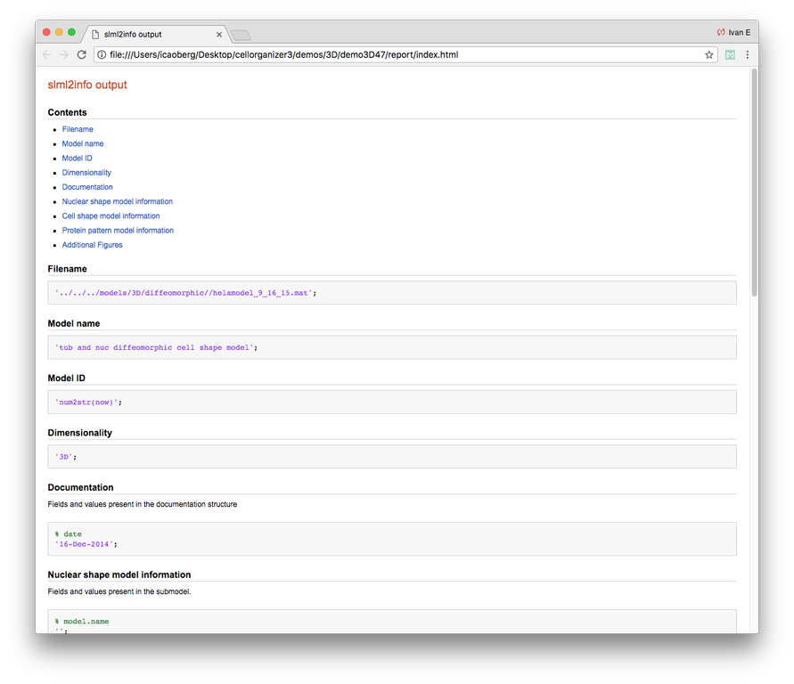
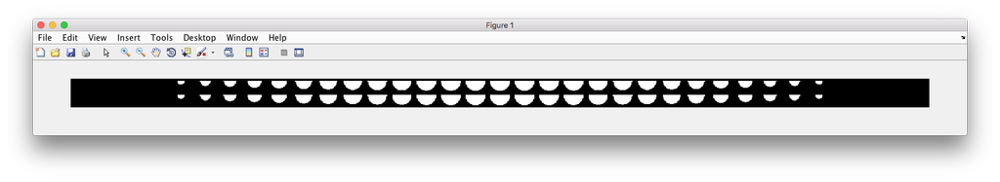
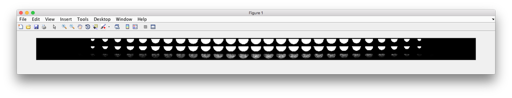

.. demos_information:

Demos
=====

2D/3D Demos
***********
For convenience, a series of demos are included with each distribution of CellOrganizer. These demos show

* how to synthesize images from existing models,
* how to train new models from raw data, as well as
* other functionality, e.g. exporting examples in multiple formats.

To display information about the available demos contained in the distribution, type in Matlab terminal::

	>> demoinfo

For example, in Ubuntu

.. raw:: html

  

Demos Summary Table
*******************
This table will let you know if the demo is meant to train a model or synthesize an image. Certains demos have been deprecated and will be removed in future versions of CellOrganizer.

+----------+------------+-------------+-----------+-------------+
|Demo      | Training   | Synthesis   | Other     | Deprecated  |
+==========+============+=============+===========+=============+
|demo2D00_ |            | True        |           |             |
+----------+------------+-------------+-----------+-------------+
|demo2D01_ | True       |             |           |             |
+----------+------------+-------------+-----------+-------------+
|demo2D02_ |            | True        |           |             |
+----------+------------+-------------+-----------+-------------+
|demo2D03_ | True       |             |           | v2.8.1     |
+----------+------------+-------------+-----------+-------------+
|demo2D04_ | True       |             |           |             |
+----------+------------+-------------+-----------+-------------+
|demo2D05_ | True       |             |           |             |
+----------+------------+-------------+-----------+-------------+
|demo2D06_ |            |  True       |           |             |
+----------+------------+-------------+-----------+-------------+
|demo2D07_ |            |  True       |           |             |
+----------+------------+-------------+-----------+-------------+
|demo2D08_ |  True      |             |           |             |
+----------+------------+-------------+-----------+-------------+
|demo2D09_ |  True      |             |           |             |
+----------+------------+-------------+-----------+-------------+
|demo3D00_ |            | True        |           |             |
+----------+------------+-------------+-----------+-------------+
|demo3D01_ |            | True        |           |             |
+----------+------------+-------------+-----------+-------------+
|demo3D04_ |            | True        |           |             |
+----------+------------+-------------+-----------+-------------+
|demo3D05_ |            | True        |           |             |
+----------+------------+-------------+-----------+-------------+
|demo3D06_ |            | True        |           | v2.8.1     |
+----------+------------+-------------+-----------+-------------+
|demo3D07_ |            | True        |           |             |
+----------+------------+-------------+-----------+-------------+
|demo3D08_ |            | True        |           |             |
+----------+------------+-------------+-----------+-------------+
|demo3D09_ |            | True        |           |             |
+----------+------------+-------------+-----------+-------------+
|demo3D10_ |            | True        |           |             |
+----------+------------+-------------+-----------+-------------+
|demo3D11_ | True       |             |           |             |
+----------+------------+-------------+-----------+-------------+
|demo3D12_ | True       |             |           |             |
+----------+------------+-------------+-----------+-------------+
|demo3D15_ |            | True        |           |             |
+----------+------------+-------------+-----------+-------------+
|demo3D17_ |            | True        |           |             |
+----------+------------+-------------+-----------+-------------+
|demo3D19_ | True       |             |  Report   |             |
+----------+------------+-------------+-----------+-------------+
|demo3D20_ | True       |             |  Plot     |             |
+----------+------------+-------------+-----------+-------------+
|demo3D25_ |            | True        |           |             |
+----------+------------+-------------+-----------+-------------+
|demo3D29_ | True       |             |  Info     |             |
+----------+------------+-------------+-----------+-------------+
|demo3D34_ |            | True        |           |             |
+----------+------------+-------------+-----------+-------------+
|demo3D35_ | True       |             |  Info     |             |
+----------+------------+-------------+-----------+-------------+
|demo3D42_ | True       |             |           |             |
+----------+------------+-------------+-----------+-------------+
|demo3D44_ |            | True        |           |             |
+----------+------------+-------------+-----------+-------------+
|demo3D47_ |            |             |  Model    |             |
+----------+------------+-------------+-----------+-------------+
|demo3D48_ | True       |             |           |             |
+----------+------------+-------------+-----------+-------------+
|demo3D49_ | True       |             |           |             |
+----------+------------+-------------+-----------+-------------+
|demo3D50_ | True       |             |           |             |
+----------+------------+-------------+-----------+-------------+
|demo3D51_ | True       |             |  Plot     |             |
+----------+------------+-------------+-----------+-------------+
|demo3D52_ | True       |             |           |             |
+----------+------------+-------------+-----------+-------------+
|demo3D53_ |            | True        |           |             |
+----------+------------+-------------+-----------+-------------+
|demo3D55_ |            | True        |  Plot     |             |
+----------+------------+-------------+-----------+-------------+
|demo3D56_ |            | True        |  Model    |             |
+----------+------------+-------------+-----------+-------------+
|demo3D57_ |            | True        |  Plot     |             |
+----------+------------+-------------+-----------+-------------+
|demo3D58_ |            | True        |           |             |
+----------+------------+-------------+-----------+-------------+
|demo3D59_ |            | True        |           |             |
+----------+------------+-------------+-----------+-------------+

Brief Descriptions
******************

.. _demo2D00:

demo2D00
--------------------------------
Demo header::

   % Synthesize one 2D image with nuclear, cell shape, and vesicular channels
   % from all vesicular object models (nucleoli, lysosomes, endosomes, and
   % mitochondria) without convolution. The model was trained from the Murphy
   % Lab 2D HeLa dataset.
   %
   % What you need
   % -------------
   % * a list of valid CellOrganizer model files
   %
   % Output
   % ------
   % * one TIFF file with six slices (nuclear, cell shape, nucleolar,
   %   lysosomal, endosomal, and mitochondrial channels)

Demo output:

.. _demo2D01:

demo2D01
--------
Demo header::

   % Train 2D generative model of the nucleus, cell shape, and lysosome using
   % all LAMP2 images in the Murphy Lab 2D HeLa dataset.
   %
   % Input
   % -----
   % * a directory of raw or synthetic nucleus images
   % * a directory of raw or synthetic cell shape images
   % * a directory of raw or synthetic lysosome images
   % * the resolution of the images (all images should have the same
   %   resolution)
   %
   % Output
   % ------
   % * a valid SLML model file

.. _demo2D02:

demo2D02
--------
Demo header::

   % Synthesize one 2D image with nuclear, cell shape, and lysosomal channels
   % from LAMP2 model trained in demo2D01 without convolution.
   %
   % Input
   % -----
   % * a valid CellOrganizer model file
   %
   % Output
   % ------
   % * one TIFF file with three slices (nuclear, cell shape, and lysosomal
   %   channels)

Demo output:

.. _demo2D03:

demo2D03
--------

This demo is deprecated. The demo will be removed in future versions of CellOrganizer.

Demo header::

   % Train 2D generative model of the nucleus, cell shape, and lysosome using
   % all LAMP2 images in the Murphy Lab 2D HeLa dataset.
   %
   % Input
   % -----
   % * a directory of raw or synthetic nucleus images
   % * a directory of raw or synthetic cell shape images
   % * a directory of raw or synthetic lysosome images
   % * the resolution of the images (all images should have the same
   %   resolution)
   %
   % Output
   % ------
   % * a valid SLML model file

.. _demo2D04:

demo2D04
--------
Demo header::

   % Train 2D generative diffeomorphic nuclear and cell shape model and a
   % lysosomal model using 10 LAMP2 images in the Murphy Lab 2D HeLa dataset.
   %
   % Input
   % -----
   % * a directory of raw or synthetic nucleus images
   % * a directory of raw or synthetic cell shape images
   % * a directory of raw or synthetic lysosome images
   % * the resolution of the images (all images should have the same
   %   resolution)
   %
   % Output
   % ------
   % * a valid SLML model file

.. _demo2D05:

demo2D05
--------
Demo header::

   % Train 2D generative pca nuclear and cell shape model using the Murphy Lab 2D HeLa dataset.
   %
   % Input
   % -----
   % * a directory of raw or synthetic nucleus images
   % * a directory of raw or synthetic cell shape images
   % * the resolution of the images (all images should have the same
   %   resolution)
   %
   % Output
   % ------
   % * a valid SLML model file

.. _demo2D06:

demo2D06
--------
Demo header::

   % Reconstruct one 2D image with nuclear, cell shape for PCA model
   %
   % Input
   % -----
   % * a valid CellOrganizer model file
   %
   % Output
   % ------
   % * one TIFF file with three slices (nuclear, cell shape, and lysosomal
   %   channels)

Demo output:

.. _demo2D07:

demo2D07
--------
Demo header::

   % Synthesize one 2D image with nuclear, cell shape with PCA model
   %
   % Input
   % -----
   % * a valid CellOrganizer model file
   %
   % Output
   % ------
   % * one TIFF file with three slices (nuclear, cell shape, and lysosomal
   %   channels)

Demo output:

.. _demo2D08:

demo2D08
--------
Demo header::

   % Train 2D generative pca nuclear and cell shape model using the Murphy Lab
   % 2D HeLa dataset and makes a shape space plot
   %
   % Input
   % -----
   % * a directory of raw or synthetic nucleus images
   % * a directory of raw or synthetic cell shape images
   % * the resolution of the images (all images should have the same
   %   resolution)
   %
   % Output
   % ------
   % * a valid SLML model file
   % * a shape space plot

.. _demo2D09:

demo2D09
--------
Demo header::

   % Train 2D generative pca nuclear and cell shape model using the Murphy Lab
   % 2D HeLa dataset and makes a shape space plot
   %
   % Input
   % -----
   % * a directory of raw or synthetic nucleus images
   % * a directory of raw or synthetic cell shape images
   % * the resolution of the images (all images should have the same
   %   resolution)
   %
   % Output
   % ------
   % * a valid SLML model file
   % * a report

.. _demo3D00:

demo3D00
--------
Demo header::

   % Synthesize one 3D image with nuclear, cell shape, and nucleolar channels
   % from nucleolar model with sampling method set to render nucleoli as
   % ellipsoids without convolution. The model was trained from the Murphy Lab
   % 3D HeLa dataset.
   %
   % Input
   % -----
   % * a valid CellOrganizer model file
   %
   % Output
   % ------
   % * three TIFF files (nuclear, cell shape, and nucleolar channels)

.. _demo3D01:

demo3D01
--------
Demo header::

   % Synthesize one 3D image with nuclear, cell shape, and vesicular channels
   % from all vesicular object models (lysosomes, mitochondria, nucleoli, and
   % endosomes) with sampling method set to render vesicular objects as
   % ellipsoids without convolution. The model was trained from the Murphy Lab
   % 3D HeLa dataset.
   %
   % Input
   % -----
   % * a list of valid CellOrganizer model files
   %
   % Output
   % ------
   % * six TIFF files (nuclear, cell shape, lysosomal, mitochondrial,
   %   nucleolar, and endosomal channels)

.. _demo3D02:

demo3D02
--------
Demo header::

   % Generate surface plot of image synthesized by demo3D00.
   %
   % Input
   % -----
   % * three TIFF files (nuclear, cell shape, and nucleolar channels)
   %   from demo3D00 directory
   %
   % Output
   % ------
   % * a surface plot of the synthetic image

.. _demo3D03:

demo3D03
--------

This demo is deprecated. The demo will be removed in future versions of CellOrganizer.

Demo header::

   % Synthesize one 3D image with nuclear, cell shape, and vesicular channels
   % from all vesicular object models (nucleoli, lysosomes, endosomes, and
   % mitochondria) with sampling method set to sample vesicular objects from
   % Gaussians at density 75 without convolution. The model was trained from
   % the Murphy Lab 3D HeLa dataset.
   %
   % Input
   % -----
   % * a list of valid CellOrganizer model files
   %
   % Output
   % ------
   % * six TIFF files (nuclear, cell shape, nucleolar, lysosomal, endosomal,
   %   and mitochondrial channels)

.. _demo3D04:

demo3D04
--------
Demo header::

   % Synthesize one 3D image with nuclear, cell shape, and vesicular channels
   % from all vesicular object models (nucleoli, lysosomes, endosomes, and
   % mitochondria) with sampling method set to sample vesicular objects from
   % Gaussians at density 75 without convolution. The model was trained from
   % the Murphy Lab 3D HeLa dataset.
   %
   % Input
   % -----
   % * a list of valid CellOrganizer model files
   %
   % Output
   % ------
   % * six TIFF files (nuclear, cell shape, nucleolar, lysosomal, endosomal,
   %   and mitochondrial channels)

.. _demo3D05:

demo3D05
--------
Demo header::

   % Synthesize one 3D image with nuclear, cell shape, and vesicular channels
   % from all vesicular object models (nucleoli, lysosomes, endosomes, and
   % mitochondria) with sampling method set to sample vesicular objects from
   % Gaussians at density 75 without convolution. The model was trained from
   % the Murphy Lab 3D HeLa dataset.
   %
   % Input
   % -----
   % * a list of valid CellOrganizer model files
   %
   % Output
   % ------
   % * six TIFF files (nuclear, cell shape, nucleolar, lysosomal, endosomal,
   %   and mitochondrial channels)

.. _demo3D06:

demo3D06
--------

This demo is deprecated. The demo will be removed in future versions of CellOrganizer.

Demo header::

   % Synthesize one 3D image with nuclear, cell shape, and protein channels
   % from all object models (nucleoli, lysosomes, endosomes, mitochondria, and
   % microtubules) with sampling method set to render vesicular objects as
   % ellipsoids and convolution with point-spread function. The model was
   % trained from the Murphy Lab 3D HeLa dataset.
   %
   % Input
   % -----
   % * a list of valid CellOrganizer model files
   %
   % Output
   % ------
   % * seven TIFF files (nuclear, cell shape, nucleolar, lysosomal, endosomal,
   %   mitochondrial, and microtubule channels)

.. _demo3D07:

demo3D07
--------
Demo header::

   % Synthesize one 3D image with nuclear, cell shape, and protein channels
   % from all object models (nucleoli, lysosomes, endosomes, mitochondria, and
   % microtubules) with sampling method set to sample vesicular objects from
   % Gaussians at a density of 25 and convolution with point-spread function.
   % The model was trained from the Murphy Lab 3D HeLa dataset.
   %
   % Input
   % -----
   % * a list of valid CellOrganizer model files
   %
   % Output
   % ------
   % * seven TIFF files (nuclear, cell shape, nucleolar, lysosomal, endosomal,
   %   mitochondrial, and microtubule channels)

.. _demo3D08:

demo3D08
--------
Demo header::

   % Synthesize one 3D image with nuclear, cell shape, and vesicular channels
   % from all vesicular object models (nucleoli, lysosomes, endosomes, and
   % mitochondria) with sampling method set to render vesicular objects as
   % ellipsoids without convolution. The model was trained from the Murphy Lab
   % 3D HeLa dataset.
   %
   % Input
   % -----
   % * a list of valid CellOrganizer model files
   %
   % Output
   % ------
   % * single indexed TIFF file which indexes the six TIFF files (nuclear,
   %   cell shape, nucleolar, lysosomal, endosomal, and mitochondrial channels)

.. _demo3D09:

demo3D09
--------
Demo header::

   % Synthesize one 3D image with nuclear, cell shape, and lysosomal channels
   % from LAMP2 model with sampling method set to render lysosomes as
   % ellipsoids without convolution. Also render 2D mean projections along XY,
   % XZ, and YZ axes of image. The model was trained from the Murphy Lab 3D
   % HeLa dataset.
   %
   % Input
   % -----
   % * a valid CellOrganizer model file
   %
   % Output
   % ------
   % * three TIFF files (nuclear, cell shape, and lysosomal channels)
   % * one projection TIFF file
   % * one projection PNG file

.. _demo3D10:

demo3D10
---------
Demo header::

   % Synthesize one 3D image with nuclear, cell shape, and lysosomal channels
   % with object files that can be imported to Blender from LAMP2 model,
   % with sampling method set to render lysosomes as ellipsoids without
   % convolution. The model was trained from the Murphy Lab 3D HeLa dataset.
   %
   % Input
   % -----
   % * a valid CellOrganizer model file
   %
   % Output
   % ------
   % * three TIFF files (nuclear, cell shape, and lysosomal channels)
   % * three Wavefront OBJ files (nuclear, cell shape, and lysosomal channels)

.. _demo3D11:

demo3D11
--------
Demo header::

   % Train 3D generative model of the cell framework (nucleus and cell shape)
   % using the Murphy Lab 3D HeLa TfR dataset.
   %
   % Input
   % -----
   % * a directory of raw or synthetic nucleus images
   % * a directory of raw or synthetic cell shape images
   % * the resolution of the images (all images should have the same
   %   resolution)
   %
   % Output
   % ------
   % * a valid model

.. _demo3D12:

demo3D12
--------
Demo header::

   % Train 3D generative model of the nucleus, cell shape, and lysosome using
   % 30 LAMP2 images in the Murphy Lab 3D HeLa dataset.
   %
   % Input
   % -----
   % * a directory of raw or synthetic nucleus images
   % * a directory of raw or synthetic cell shape images
   % * a directory of raw or synthetic lysosome images
   % * the resolution of the images (all images should have the same
   %   resolution)
   %
   % Output
   % ------
   % * a valid SLML model file

.. _demo3D13:

demo3D13
--------
Demo header::

   % Export images synthesized by demo3D01 as object files importable to
   % Blender.
   %
   % Input
   % -----
   % * a directory of 3D synthetic images
   %
   % Output
   % ------
   % * Wavefront OBJ files

.. _demo3D14:

demo3D14
--------
Demo header::

   % Render 2D mean projections along XY, XZ, and YZ axes of images
   % synthesized by demo3D00.
   %
   % Input
   % -----
   % * a directory of 3D synthetic images
   %
   % Output
   % ------
   % * projections of synthetic images as TIFF files

.. _demo3D15:

demo3D15
--------
Demo header::

   % Synthesize one multichannel 3D image from an endosomal model and
   % diffeomorphic nuclear and cell shape model. The sampling method was set
   % to render endosomes as ellipsoids without convolution. The model was
   % trained from the Murphy Lab 3D HeLa dataset.
   %
   % Input
   % -----
   % * a valid CellOrganizer model file with a diffeomorphic framework
   %
   % Output
   % ------
   % * three TIFF files (nuclear, cell shape, and endosomal channels)

.. _demo3D16:

demo3D16
--------
Demo header::

   % The main idea behind this demo is to show the user they
   % can use their own binary images from raw experimental data
   % to synthesize protein patterns. This demo uses the CellOrganizer
   %  method for nuclear and cell segmentation.
   %
   % The current demo assumes the resolution of the images is the same as
   % the resolution of the images that were used to train the protein model.
   %
   % Input
   % -----
   % * raw or synthetic images of the nuclear and cell membrane
   % * a valid CellOrganizer model file
   %
   % Output
   % ------
   % * three TIFF files (cell shape, nuclear, and lysosomal channels)

.. _demo3D17:

demo3D17
--------
Demo header::

   % The main idea behind this demo is to show the user they
   % can use their own binary images from raw experimental data
   % to synthesize protein patterns.
   %
   % The current demo assumes the resolution of the images is the same
   % as the resolution of the images that were used to train the protein model.
   %
   % Input
   % -----
   % * an existing raw or synthetic framework, i.e. one binary multi-TIFF
   % file of the nuclear channel and one binary multi-TIFF file of the
   % cell membrane
   % * the resolution of the latter images
   % * a valid CellOrganizer model that contains a protein model
   %
   % Output
   % ------
   % * three TIFF files (cell shape, nuclear, and lysosomal channels)

.. _demo3D18:

demo3D18
--------

This demo is deprecated. The demo will be removed in future versions of CellOrganizer.

Demo header::

   % Train 3D generative model of the cell framework (nucleus and cell shape),
   % using hole-finding to infer both nucleus and cell shape from the supplied
   % protein pattern. The 3D 3T3 dataset was collected in collaboration with
   % Dr. Jonathan Jarvik and Dr. Peter Berget.
   %
   % Input
   % -----
   % * a directory of raw or synthetic protein images
   % * the resolution of the images (all images should have the same
   %   resolution)
   %
   % Output
   % ------
   % * a valid SLML model

.. _demo3D19:

demo3D19
--------
Demo header::

   % This demo uses slml2report to compare the parameters between
   % CellOrganizer models and returns a report.
   %
   % Input
   % -----
   % * a set of valid CellOrganizer models
   %
   % Output
   % ------
   % * a report

.. _demo3D20:

demo3D20
--------
Demo header::

   % Train 3D generative diffeomorphic model of the cell framework (nucleus
   % and cell shape) using 10 images Murphy Lab 3D HeLa LAMP2 dataset.
   %
   % Input
   % -----
   % * a directory of raw or synthetic nucleus images
   % * a directory of raw or synthetic cell shape images
   % * a directory of raw or synthetic lysosome images
   % * the resolution of the images (all images should have the same
   %   resolution)
   %
   % Output
   % -------
   % * a valid SLML model file
   % * a visualization of the shape space

.. _demo3D21:

demo3D21
--------

This demo is deprecated. The demo will be removed in future versions of CellOrganizer.

Demo header::

   % Train 3D generative model of the cell framework (nucleus and cell shape),
   % using hole-finding to infer both nucleus and cell shape from the supplied
   % protein pattern. This is identical to demo3D18 minus scaling the
   % images. The 3D 3T3 dataset was collected in collaboration with Dr.
   % Jonathan Jarvik and Peter Berget.
   %
   % Input
   % -----
   % * a directory of raw or synthetic protein images
   % * the resolution of the images (all images should have the same
   %   resolution)
   %
   % Output
   % ------
   % * a valid SLML model

.. _demo3D22:

demo3D22
--------
Demo header::

   % Synthesizes a protein pattern instance from the synthetic image produced
   % in demo3D00.
   %
   % Input
   % -----
   % * a synthetic framework
   %
   % Output
   % ------
   % * a synthetic image

.. _demo3D23:

demo3D23
--------

This demo is deprecated. The demo will be removed in future versions of CellOrganizer.

Demo header::

   % Train 3D generative diffeomorphic nuclear, cell shape, and a
   % lysosomal model from all LAMP2 images in the Murphy Lab 3D HeLa dataset.
   %
   % Input
   % -----
   % * a directory of raw or synthetic nucleus images
   % * a directory of raw or synthetic cell shape images
   % * a directory of raw or synthetic lysosome images
   % * the resolution of the images (all images should have the same
   %   resolution)
   %
   % Output
   % ------
   % * a valid SLML model file

.. _demo3D24:

demo3D24
----------

This demo is deprecated. The demo will be removed in future versions of CellOrganizer.

Demo header::

   % This demo converts a sample SBML file to an SBML-spatial instance using
   % the "matchSBML" function. This function takes an SBML file, matches the
   % compartments in the file with available models and synthesizes the
   % appropriate instances.
   %
   % Input
   % -----
   % * sample SBML file
   %
   % Output
   % ------
   % * valid SBML model

.. _demo3D25:

demo3D25
----------
Demo header::

   % Synthesizes 1 image using a lysosomal model with sampling mode
   % set to 'disc', no convolution and output.SBML set to true.
   % Results will be three TIFF files, one each for cell boundary,
   % nuclear boundary, and lysosomes, in folder "synthesizedImages/cell1"
   % Additionally, in the folder "synthesizedImages/" will be a
   % SBML-Spatial(v0.82a) formatted .xml file containing constructed solid
   % geometry(CSG) primitives for lysosomes and parametric objects for the
   % cell and nuclear shapes.
   %
   % These files can then be read into VCell using the built in importer or
   % CellBlender using the helper function provided in this distribution.
   %
   % Input
   % -----
   % * valid SBML model
   %
   % Output
   % ------
   % * three TIFF files
   % * XML file with primitives for lysosomes and parametric objects

.. _demo3D26:

demo3D26
--------
Demo header::

   % This function displays a shape space of some dimensionality. This demo
   % uses the model trained in Johnson 2015.
   %
   % Input
   % -----
   % * a CellOrganizer diffeomorphic model
   %
   % Output
   % ------
   % * a display of the shape space

.. _demo3D27:

demo3D27
--------

This demo is deprecated. The demo will be removed in future versions of CellOrganizer.

Demo header::

   % This demo performs a regression between two sets of related shapes (i.e.
   % predicts cell  shape from nuclear shape) and displays the residuals as in
   % Figure 2 of Johnson et al 2015.
   %
   % Input
   % -----
   % * models hela_cell_10_15_15.mat and hela_nuc_10_15_15.mat
   %
   % Output
   % ------
   % * shape space figure

.. _demo3D28:

demo3D28
--------
Demo header::

   % Synthesize one 3D image with nuclear, cell shape, and nucleolar channels
   % from nucleolar model with sampling method set to render nucleoli as
   % ellipsoids without convolution. The model was trained from the Murphy Lab
   % 3D HeLa dataset.
   %
   % Input
   % -----
   % * an existing raw or synthetic nuclear image, i.e. one binary multi-TIFF
   %   file of the nuclear channel
   % * the resolution of the input image
   % * a valid CellOrganizer model that contains a cell membrane model
   %
   % Output
   % ------
   % * three TIFF files (cell shape, nuclear, and nucleolar channels)

.. _demo3D29:

demo3D29
--------
Demo header::

   % Displays information about a model
   %
   % Input
   % -----
   % * valid model
   %
   % Output
   % ------
   % * details about the models

.. _demo3D30:

demo3D30
--------

This demo is deprecated. The demo will be removed in future versions of CellOrganizer.

Demo header::

   % This demo illustrates how to sample uniformly at random from a
   % diffeomorphic model.
   %
   % Input
   % -----
   % * a valid CellOrganizer model file
   %
   % Output
   % ------
   % * a random walk

.. _demo3D31:

demo3D31
--------
Demo header::

   % Trains a generative model of microtubules
   %
   % Input
   % -----
   % * a directory of raw or synthetic nucleus images
   % * a directory of raw or synthetic cell shape images
   % * the resolution of the images (all images should have the same
   %   resolution)
   %
   % Output
   % ------
   % * a valid model

.. _demo3D32:

demo3D32
--------
Demo header::

   % Synthesizes 1 image using a lysosomal model with sampling mode
   % set to 'disc', no convolution using the object avoidance methods
   % Results will be three TIFF files, one each for cell boundary,
   % nuclear boundary, and lysosomes, in folder "synthesizedImages/cell1".
   %
   % Input
   % -----
   % * valid SBML file
   %
   % Output
   % ------
   % * three TIFF files

.. _demo3D33:

demo3D33
--------
Demo header::

   % Synthesize multiple 3D images from a lysosome model, at different resolutions.
   %
   % Input
   % -----
   % * a valid CellOrganizer model file
   %
   % Output
   % -------
   % * multiple instances of the same cell at different resolutions

.. _demo3D34:

demo3D34
--------
Demo header::

   % Synthesize one 3D image with nuclear, cell shape and a vesicular channel.
   % This demo exports the synthetic image as an OME.TIFF as well as an
   % SBML Spatial instance.
   %
   % Input
   % -----
   % * a valid CellOrganizer model
   %
   % Output
   % ------
   % * OME.TIFF
   % * SBML instance
   % * single channel TIF files

.. _demo3D35:

demo3D35
--------
Demo header::

   % This demo uses slml2model to display information from a valid model file
   %
   % Input
   % -----
   % * a valid CellOrganizer model
   %
   % Output
   % ------
   % * a report

Demo output:

.. _demo3D36:

demo3D36
--------
Demo header::

   % Synthesize multiple 3D images from a lysosome model at different resolutions.
   %
   % Input
   % -----
   % * valid lysosomal model
   %
   % Output
   % ------
   % * multiple 3D images at different resolutions

.. _demo3D37:

demo3D37
--------
Demo header::

   % This demo exists to illustrate how padding size and window size affect the
   % performance of diffeomorphic metric.
   %
   % Input
   % -----
   % * a directory of raw or synthetic nucleus images
   % * a directory of raw or synthetic cell shape images
   % * a directory of raw or synthetic lysosome images
   % * the resolution of the images (all images should have the same
   %   resolution)
   %
   % Output
   % -------
   % * a valid SLML model file

.. _demo3D38:

demo3D38
--------
Demo header::

   % Synthesizes 1 image using a lysosomal model with sampling mode
   % set to 'disc', no convolution using the object avoidance methods
   % Results will be three TIFF files, one each for cell boundary,
   % nuclear boundary, and lysosomes, in folder "synthesizedImages/cell1".
   %
   % Input
   % -----
   % * a valid CellOrganizer model file
   %
   % Output
   % ------
   % * three TIFF files (nuclear, cell shape, and nucleolar channels)

.. _demo3D39:

demo3D39
--------
Demo header::

   % This demo illustrates how to sample uniformly at random from a
   % diffeomorphic model.
   %
   % Input
   % -----
   % * a valid CellOrganizer model file
   %
   % Output
   % ------
   % * a random walk

.. _demo3D40:

demo3D40
--------
Demo header::

   % Train 3D generative framework model from all LAMP2 images in the Murphy Lab 3D HeLa dataset.
   %
   % Input
   % -----
   % * a directory of raw or synthetic nucleus images
   % * a directory of raw or synthetic cell shape images
   % * a directory of raw or synthetic lysosome images
   % * the resolution of the images (all images should have the same
   %   resolution)
   %
   % Output
   % ------
   % * a valid SLML model file

.. _demo3D41:

demo3D41
--------
Demo header::

   % Train 3D generative model of the nucleus, cell shape, and lysosome from
   % all LAMP2 images in the Murphy Lab 3D HeLa dataset that are either in the
   % current directory or in the demo3D11 directory.
   %
   % Input
   % -----
   % * a directory of raw or synthetic nucleus images
   % * a directory of raw or synthetic cell shape images
   % * a directory of raw or synthetic lysosome images
   % * the resolution of the images (all images should have the same
   %   resolution)
   %
   % Output
   % ------
   % * a valid SLML model file

.. _demo3D42:

demo3D42
--------
Demo header::

   % This demo illustrates using CellOrganizer to train a protein distribution
   % model following the approach described in
   %
   % K. T. Roybal, T. E. Buck, X. Ruan, B. H. Cho, D. J. Clark, R. Ambler,
   % H. M. Tunbridge, J. Zhang, P. Verkade, C. Wülfing, and R. F. Murphy (2016)
   % Computational spatiotemporal analysis identifies WAVE2 and Cofilin as
   % joint regulators of costimulation-mediated T cell actin dynamics.
   % Science Signaling 9:rs3. doi: 10.1126/scisignal.aad4149.
   %
   % The slowest step, which typically takes about 1 min per cell per frame,
   % is to align each cell at each time to the standardized template.
   % This demo uses 46 cells so it will take about 1 hour on a single core.
   %
   % Input
   % -----
   % * image and annotation files for one or more proteins for one or more
   % time points
   %   > the default is to use images from the paper of LAT at time 0 - downloading the
   %   needed images requires about 4 GB of free disk space
   %
   % Output
   % ------
   % * a model for the average concentration in each voxel of a standardized
   % cell shape (in demos/LAT_reltime_1.mat)
   % * various intermediate results files (in /param and /tmp)

.. _demo3D43:

demo3D43
--------
Demo header::

   % This is the synthesis demo for T cell model.
   % The demo takes in two models: one model contains both cell and nuclear
   % shape models, and the other contains a T cell protein shape model. Same
   % as other synthesis framework, it calls slml2img for the synthesis. The
   % meanings of the options are commented in the script.
   %
   % Input
   % -----
   % * A protein model with type standardized map halp-elipsoid
   % * A framework model the provide the shape of the cell.
   %
   % Output
   % ------
   % * one or more set(s) of synthesized images with cell shape and protein
   % pattern.

.. _demo3D44:

demo3D44
--------
Demo header::

   % Synthesize a cell shape image from a given constructive_geometry model,
   % specifically a half-ellipsoid model.
   %
   % Input
   % -----
   % * a list of valid CellOrganizer half-ellipsoid model files
   %
   % Output
   % ------
   % * a 3D stacked TIFF file

Demo output:

.. _demo3D45:

demo3D45
--------
Demo header::

   % Train 3D generative model of the cell framework (nucleus and cell shape)
   % using the Murphy Lab 3D HeLa TfR dataset.
   %
   % Input
   % -----
   % * a directory of raw or synthetic nucleus images
   % * a directory of raw or synthetic cell shape images
   % * the resolution of the images (all images should have the same
   %   resolution)
   %
   % Output
   % ------
   % * a valid model

.. _demo3D46:

demo3D46
--------
Demo header::

   % This is the synthesis demo for T cell model.
   % The demo takes in two models: one model contains both cell and nuclear
   % shape models, and the other contains a T cell protein shape model. Same
   % as other synthesis framework, it calls slml2img for the synthesis. The
   % meanings of the options are commented in the script.
   %
   % Input
   % -----
   % * A protein model with type standardized map halp-elipsoid
   % * A framework model the provide the shape of the cell.
   %
   % Output
   % ------
   % * one or more set(s) of synthesized images with cell shape and protein
   % pattern.

Demo output:

.. _demo3D47:

demo3D47
--------
Demo header::

   % Combine two generative model files into a single file.
   %
   % Input
   % -----
   % * a list of valid CellOrganizer model files
   %
   % Output
   % ------
   % * a valid model

.. _demo3D48:

demo3D48
--------
Demo header::

% This demo illustrates using CellOrganizer to train an updated version of
% protein distribution model following the approach described in
%
% K. T. Roybal, T. E. Buck, X. Ruan, B. H. Cho, D. J. Clark, R. Ambler,
% H. M. Tunbridge, J. Zhang, P. Verkade, C. Wülfing, and R. F. Murphy (2016)
% Computational spatiotemporal analysis identifies WAVE2 and Cofilin as
% joint regulators of costimulation-mediated T cell actin dynamics.
% Science Signaling 9:rs3. doi: 10.1126/scisignal.aad4149.
%
% The updates include:
%    1. one point synapse annotation is allowed as valid input;
%    2. a method is implemented for synapse detection with only providing
%       the first time point.
%    3. the method for aligmentment adjustment is implemented.
%
% The slowest step, which typically takes about 1 min per cell per frame,
% is to align each cell at each time to the standardized template.
% This demo uses 46 cells so it will take about 1 hour on a single core.
%
% Input
% -----
% * image and annotation files for one or more proteins for the first
% time point (the default is to use images from the paper of LAT at time 0
% - downloading the needed images requires about 4 GB of free disk space)
%
% Output
% ------
% * a model for the average concentration in each voxel of a standardized
% cell shape (in demos/LAT_reltime_1.mat)
% * various intermediate results files (in /param and /tmp)

.. _demo3D49:

demo3D49
--------
Demo header::

% This demo illustrates using CellOrganizer to train a protein distribution
% model following the approach described in
%
% K. T. Roybal, T. E. Buck, X. Ruan, B. H. Cho, D. J. Clark, R. Ambler,
% H. M. Tunbridge, J. Zhang, P. Verkade, C. Wuelfing, and R. F. Murphy (2016)
% Computational spatiotemporal analysis identifies WAVE2 and Cofilin as
% joint regulators of costimulation-mediated T cell actin dynamics.
% Science Signaling 9:rs3. doi: 10.1126/scisignal.aad4149.
%
% The slowest step, which typically takes about 1 min per cell per frame,
% is to align each cell at each time to the standardized template.
% This demo uses 46 cells so it will take about 1 hour on a single core.
%
% Input
% -----
% * OMETIFF images with image and annotation files for one or more proteins for one or more
% time points (the default is to use images from the paper of LAT at time 0
% - downloading the needed images requires about 4 GB of free disk space)
%
% Output
% ------
% * a model for the average concentration in each voxel of a standardized
% cell shape (in demos/LAT_reltime_1.mat)
% * various intermediate results files (in /param and /tmp)

.. _demo3D50:

demo3D50
--------
Demo header::

% Train 3D generative SPHARM-RPDM cell shape model using the Murphy Lab 3D HeLa dataset.
%
% Input
% -----
% * a directory of raw or synthetic nucleus images
% * a directory of raw or synthetic cell shape images
% * the resolution of the images (all images should have the same
%   resolution)
%
% Output
% ------
% * a valid SLML model file

.. _demo3D51:

demo3D51
--------
Demo header::

% Show shape evolution plot with a trained SPHARM-RPDM model with only cell shape
%
% Input
% -----
% * a directory of raw or synthetic nucleus images
% * a directory of raw or synthetic cell shape images
% * the resolution of the images (all images should have the same
%   resolution)
%
% Output
% ------
% * a valid SLML model file
% * a shape space plot

.. _demo3D52:

demo3D52
--------
Demo header::

% Train 3D generative SPHARM-RPDM nuclear and cell shape model using the
% Murphy Lab 3D HeLa dataset.
%
% Input
% -----
% * a directory of raw or synthetic nucleus images
% * a directory of raw or synthetic cell shape images
% * the resolution of the images (all images should have the same
%   resolution)
%
% Output
% ------
% * a valid SLML model file

.. _demo3D53:

demo3D53
--------
Demo header::

% Reconstruct one 3D image with nuclear, cell shape for SPHARM-RPDM model
%
% Input
% -----
% * a valid CellOrganizer model file
%
% Output
% ------
% * one TIFF file with three slices (nuclear, cell shape, and lysosomal
%   channels)

.. _demo3D55:

demo3D55
--------
Demo header::

% Show shape space plot with a trained SPHARM-RPDM model
%
% Input
% -----
% * a directory of raw or synthetic nucleus images
% * a directory of raw or synthetic cell shape images
% * the resolution of the images (all images should have the same
%   resolution)
%
% Output
% ------
% * a valid SLML model file
% * a shape space plot

.. _demo3D56:

demo3D56
--------
Demo header::

% This demo illustrates using CellOrganizer to train an updated version of
% protein distribution model following the approach described in
%
% K. T. Roybal, T. E. Buck, X. Ruan, B. H. Cho, D. J. Clark, R. Ambler,
% H. M. Tunbridge, J. Zhang, P. Verkade, C. Wülfing, and R. F. Murphy (2016)
% Computational spatiotemporal analysis identifies WAVE2 and Cofilin as
% joint regulators of costimulation-mediated T cell actin dynamics.
% Science Signaling 9:rs3. doi: 10.1126/scisignal.aad4149.
%
% The updates include:
%    1. one point synapse annotation is allowed as valid input;
%    2. a method is implemented for synapse detection with only providing
%       the first time point.
%    3. the method for aligmentment adjustment is implemented.
%
% The slowest step, which typically takes about 1 min per cell per frame,
% is to align each cell at each time to the standardized template.
% This demo uses 46 cells so it will take about 1 hour on a single core.
%
% Input
% -----
% * OMETIFF images with image and annotation files for one or more proteins for the first
% time point (the default is to use images from the paper of LAT at time 0
% - downloading the needed images requires about 4 GB of free disk space)
%
% Output
% ------
% * a model for the average concentration in each voxel of a standardized
% cell shape (in demos/LAT_reltime_1.mat)
% * various intermediate results files (in /param and /tmp)

.. _demo3D57:

demo3D57
--------
Demo header::

% This demo illustrates using CellOrganizer to show protein enrichment plot
% for certain regions of the 3D T cell following the approach described in
%
% K. T. Roybal, T. E. Buck, X. Ruan, B. H. Cho, D. J. Clark, R. Ambler,
% H. M. Tunbridge, J. Zhang, P. Verkade, C. Wülfing, and R. F. Murphy (2016)
% Computational spatiotemporal analysis identifies WAVE2 and Cofilin as
% joint regulators of costimulation-mediated T cell actin dynamics.
% Science Signaling 9:rs3. doi: 10.1126/scisignal.aad4149.
%
% Input
% -----
% * a set of t cell models with different time points
%
% Output
% ------
% * Plots of enrichment for different purpose

.. _demo3D58:

demo3D58
--------
Demo header::

% demo3D58
%
% Synthesize one 3D image with nuclear, cell shape and a vesicular channel.
%
% Input
% -----
% * a valid CellOrganizer model file
%
% Output
% ------
% * three TIFF files (nuclear, cell shape, and nucleolar channels)

.. _demo3D59:

demo3D59
--------
Demo header::

% demo3D59
%
% Synthesize one 3D image with nuclear, cell shape and a vesicular channel.
% This demo exports portions of the synthetic image as SBML Spatial instances.
%
% Input
% -----
% * a valid CellOrganizer model
%
% Output
% ------
% * SBML instance
% * single channel TIF files

demo3D60
--------
Demo header::

% demo3D60
%
% Synthesize one 3D image with nuclear, cell shape and a vesicular channel. 
% This demo exports the synthetic image as Virtual Cell VCML.
%
% Input 
% -----
% * a valid CellOrganizer model
%
% Output
% ------
% * VCML file
% * single channel TIF files
