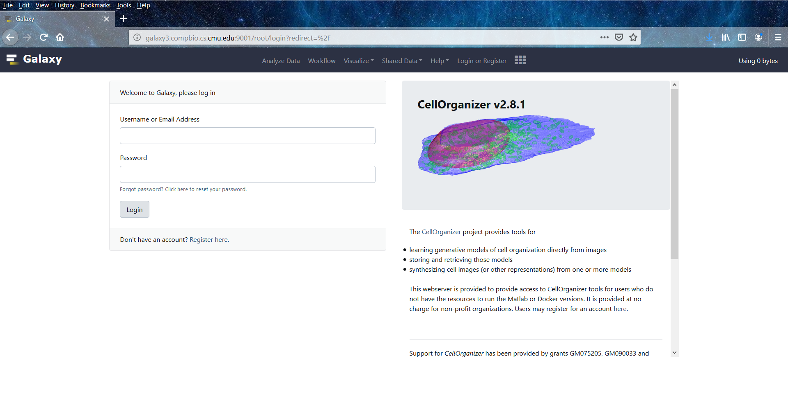
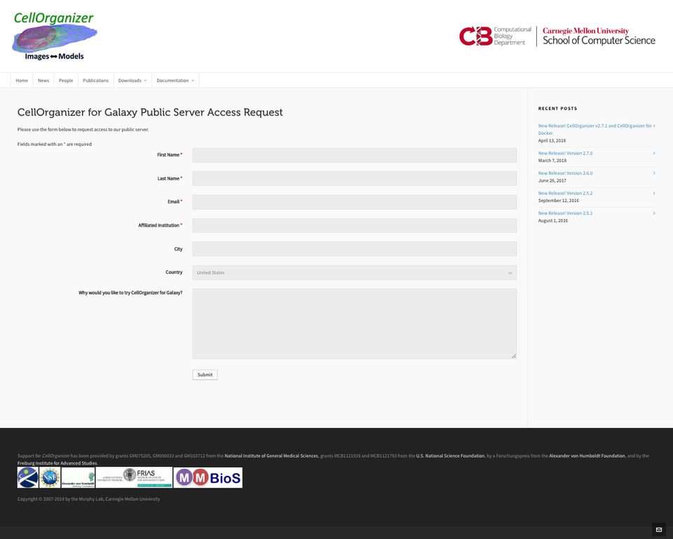

About CellOrganizer for Galaxy
==============================

CellOrganizer for Galaxy is a set of tools that enables users to train generative models of the cell from microscopy images, analyze trained generative models, and synthesize instances using CellOrganizer.

Using Galaxy
============

Galaxy is an open source, web-based platform for data intensive research.

There are many approaches to learning how to use Galaxy. To learn about Galaxy using the official tutorials, click `here <https://galaxyproject.org/learn/>`_.

Using CellOrganizer for Galaxy
==============================

To start using CellOrganizer for Galaxy you can either

* install the tools in your own Galaxy instance
* use our public server

Installing local instance of CellOrganizer for Galaxy
----------------------------------------------------
Before you attempt to install the tools make sure to have

* A working Galaxy instance. Installing Galaxy is beyond the scope of this document. Please refer to the `official documentation <https://galaxyproject.org/admin/get-galaxy/>`_ to install an instance.
* Matlab. Matlab should be installed in the same machine running Galaxy. Installing Matlab is beyond the scope of this document. Please refer to the  `official documentation <https://www.mathworks.com/support/install-matlab.html?q=&page=1>`_ to build an instance.
* The Matlab binary must be in the `$PATH` of the user running Galaxy.

  For example
  
  ```
  ~ export PATH=$(PATH):/opt/matlab/bin  
  ~ echo $PATH
  /usr/local/sbin:/usr/local/bin:/usr/sbin:/usr/bin:/sbin:/bin:/usr/games:/usr/local/games:/opt/matlab/bin

  ~ which matlab
  /opt/matlab/bin/matlab
  ```
CellOrganizer must be downloaded into the system running Galaxy. 

* Its location should be set in an environment variable called `$CELLORGANIZER`. The environment variable needs to be accessible to the user running your Galaxy instance. Make sure the user running Galaxy has reading permissions on the CellOrganizer location.

  ```
  ~ chown -R galaxy:galaxy /usr15/galaxy/cellorganizer-galaxy-tools-v2.9.0/cellorganizer3
  ~ export CELLORGANIZER=/usr15/galaxy/cellorganizer-galaxy-tools-v2.9.0/cellorganizer3
  ~ echo $CELLORGANIZER 
    /usr15/galaxy/cellorganizer-galaxy-tools-v2.9.0/cellorganizer3
  ```

* To download CellOrganizer visit the `official website <http://www.cellorganizer.org>`_. Please make sure the version of CellOrganizer you install matches the version of CellOrganizer for Galaxy. 

* Copy the CellOrganizer tools into the `$GALAXY/tools`. The variable `$GALAXY`, as explained in the official documentation, holds the location of your Galaxy instance.

Accessing the CellOrganizer for Galaxy public server
----------------------------------------------------

The CellOrganizer for Galaxy public server can be accessed at `galaxy.compbio.cs.cmu.edu <http://galaxy3.compbio.cs.cmu.edu:9000/root/login?redirect=%2F/>`_. This webserver is provided to grant access to CellOrganizer tools for users who do not have the resources to run the Matlab or Docker versions.  It is provided at no charge for non-profit organizations.



   CellOrganizer for Galaxy public server welcome page.

Getting started
^^^^^^^^^^^^^^^

Galaxy Registration
"""""""""""""""""""

Before you start using CellOrganizer for Galaxy, you must request access to the public server. To request access, click `here <http://www.cellorganizer.org/public-server-access-request/>`_



   CellOrganizer for Galaxy public server request page.

Shortly after, you will receive an email with your credentials.

Essential features of CellOrganizer for Galaxy
^^^^^^^^^^^^^^^^^^^^^^^^^^^^^^^^^^^^^^^^^^^^^^

Homepage
""""""""

The homepage is divided into four parts

    .. figure:: ../../source/images/galaxyinterface.png

* Navigation bar (top of the page)
* Tools (left side of the page)
* History (right side of the page)
* Main Content window (center of the page)

The **Tools** section lists all the tools that are available to the user. For user convenience, we have grouped the tools into six categories

* Get Data (E.g under the Get Data section we have the following three tools)
* Training
* Synthesis
* Useful tools for images
* Useful tools for models
* File Validators

The **History** window lists all the jobs that the user has submitted and indicates their respective statuses via color coding. Whenever the user executes a tool, it will submit a new job that will appear at the top of the **History** window as a rectangular box with a designed number and a descriptive name. The color of the box indicates the status of the corresponding job.

* *Gray* means that the job has been submitted but not yet added to the job queue
* *Yellow* means that the job has been submitted to the job queue
* *Red* means that the job either exited before completion, or did not produce the expected output
* *Green* means that the job ran successfully to completion and is ready to be viewed

The **Main Content** window is the CellOrganizer for Galaxy workspace. Once a tool or workflow (this term will be explained later) has been selected from the Tool Window, the user can specify the input parameters via the Main Content window.

List of Tools
"""""""""""""

The tools included in this release are

* **Upload file** from your computer. This tool lets the user upload any file type to the Galaxy instance into the current workspace.
* **Imports image** from a URL. This tool lets the user upload an OME.TIFF from URL and validate its metadata using BioFormats into the current workspace.
* **Imports model** from the curated model repository. This tool lets the user to import a model from the CellOrganizer curated model repository into the current workspace.
* **Trains a generative model** from a collection of OME.TIFFs.
* **Generates a synthetic image** from a valid SLML model.
* **Exports a 2D synthetic image** to a format that can be imported in VCell.
* **Generates a surface plot** from a 3D OME.TIFF image.
* **Makes an RGB projection** from an OME.TIFF.
* **Makes a projection** from an OME.TIFF.
* **Print information** about a generative model file.
* **Combine multiple generative model files** into a single file.
* **Display shape space plot** from a diffeomorphic or PCA model.
* **Validates an OME.TIFF**.
* **Validates an SBML Level 3 instance**.
* **Validates a Wavefront OBJ file**.

Work Histories
""""""""""""""

**Work Histories** are Galaxy's way of enabling users to create multiple isolated workspaces. You can think of your current **Work History** as your current workspace. At any point in time, your **History** window displays all the data you have either downloaded or produced in your current workspace.

Let's say you download some data into your current **Work History**. That data is now accessible to tools in your **Tools Window**. You can apply any tool on that data, provided that it considers the data as valid input. The output of this operation will get saved to your current **Work History**, and now you can even apply tools to this newly accessible data as well.

If you now want to work on unrelated data, you can simply create a new **Work History**, switch your workspace to that newly created **Work History**, and work on that data without having to see the clutter of the previous workspace. Of course, you can always switch between Work Histories whenever you like.

**Work Histories** can be shared between Galaxy users, allowing them to see each other's outputs/errors.

This table contains information about CellOrganizer demos. Click on the demo name to open the demo history in CellOrganizer for Galaxy tools.

We have provided links to sample histories constructed from CellOrganizer demos.

+----------+------------+-------------+-----------+-------------+
|Demo      | Training   | Synthesis   | Other     | Deprecated  |
+==========+============+=============+===========+=============+
|demo2D00_ |            | True        |           |             |   
+----------+------------+-------------+-----------+-------------+
|demo2D01_ | True       |             |           |             |   
+----------+------------+-------------+-----------+-------------+
|demo2D05_ | True       |             |           |             |     
+----------+------------+-------------+-----------+-------------+
|demo2D08_ |  True      |             |           |             |    
+----------+------------+-------------+-----------+-------------+
|demo2D09_ |  True      |             |           |             |    
+----------+------------+-------------+-----------+-------------+
|demo3D00_ |            | True        |           |             |    
+----------+------------+-------------+-----------+-------------+
|demo3D01_ |            | True        |           |             |    
+----------+------------+-------------+-----------+-------------+
|demo3D03_ |            | True        |           |             |    
+----------+------------+-------------+-----------+-------------+
|demo3D04_ |            | True        |           |             |    
+----------+------------+-------------+-----------+-------------+
|demo3D05_ |            | True        |           |             |     
+----------+------------+-------------+-----------+-------------+
|demo3D12_ | True       |             |           |             |    
+----------+------------+-------------+-----------+-------------+
|demo3D52_ | True       |             |           |             |     
+----------+------------+-------------+-----------+-------------+
|demo3D55_ |            | True        |  Plot     |             |     
+----------+------------+-------------+-----------+-------------+ 
|demo3D57_ |            | True        |           |             |     
+----------+------------+-------------+-----------+-------------+ 
|demo3D59_ |            | True        |           |             |     
+----------+------------+-------------+-----------+-------------+ 


.. _demo2D00: http://galaxy3.compbio.cs.cmu.edu:9000/u/cellorganizer/h/demo2d00
.. _demo2D01: http://galaxy3.compbio.cs.cmu.edu:9000/u/cellorganizer/h/demo2d01
.. _demo2D05: http://galaxy3.compbio.cs.cmu.edu:9000/u/cellorganizer/h/demo2d05
.. _demo2D08: http://galaxy3.compbio.cs.cmu.edu:9000/u/cellorganizer/h/demo2d08
.. _demo2D09: http://galaxy3.compbio.cs.cmu.edu:9000/u/cellorganizer/h/demo2d09
.. _demo3D00: http://galaxy3.compbio.cs.cmu.edu:9000/u/cellorganizer/h/demo3d00
.. _demo3D01: http://galaxy3.compbio.cs.cmu.edu:9000/u/cellorganizer/h/demo3d01
.. _demo3D03: http://galaxy3.compbio.cs.cmu.edu:9000/u/cellorganizer/h/demo3d03
.. _demo3D04: http://galaxy3.compbio.cs.cmu.edu:9000/u/cellorganizer/h/demo3d04
.. _demo3D05: http://galaxy3.compbio.cs.cmu.edu:9000/u/cellorganizer/h/demo3d05
.. _demo3D12: http://galaxy3.compbio.cs.cmu.edu:9000/u/cellorganizer/h/demo3d12
.. _demo3D52: http://galaxy3.compbio.cs.cmu.edu:9000/u/cellorganizer/h/demo3d52
.. _demo3D55: http://galaxy3.compbio.cs.cmu.edu:9000/u/cellorganizer/h/demo3d55
.. _demo3D57: http://galaxy3.compbio.cs.cmu.edu:9000/u/cellorganizer/h/demo3d57
.. _demo3D59: http://galaxy3.compbio.cs.cmu.edu:9000/u/cellorganizer/h/demo3d59


Detailed information about **Histories** is beyond the scope of this document. To learn more about them, click `here <https://galaxyproject.org/tutorials/histories/>`_.

Jobs
""""

Whenever you manage to execute a tool, you are essentially submitting a job to the server. And to execute a tool, you need to both provide the minimal set of inputs and to provide valid inputs. Whenever you click on one of the tools in the **Tools Window**, you should also see accompanying documentation in the **Main Content** window specifying what sort of inputs you need to provide to the tool.

Detailed information about **Jobs** is beyond the scope of this document. To learn more about them, click `here <https://galaxyproject.org/support/how-jobs-execute/>`_.

Workflows
"""""""""

**Workflows** are Galaxy's way of enabling users to automate particular pipelines (which can even be shared among users). You can also think of them as a means to construct more complex tools by piecing together simpler ones.

Let's say you keep on repeating a certain procedure. You download data, run a tool on it to produce some output, then visualize the output. Each time you repeat the procedure, you first have to click on the tool to download data and fill up the necessary input values, then you have to wait for the data to be downloaded, then you have to click on the tool you wanted to run on the data and fill up the necessary input values, then ... and so on. This is unnecessarily tedious.

Instead, we can streamline the procedure by linking the intermediate stages together via a **Workflow**. We get to fill up the necessary parameter settings that the intermediate stages require all at once. Then we can simply click run and wait for the final output.

We have provided links to sample workflows constructed using CellOrganizer for Galaxy tools.

+--------------------------------------------------------------------+
| Workflow Name                                                      |
+====================================================================+
| Train-2D-PCA-framework-generative-model_                           |
+--------------------------------------------------------------------+
| Train-2D-classic-generative-model_                                 |
+--------------------------------------------------------------------+
| Train-2D-classic-framework-generative-model_                       |
+--------------------------------------------------------------------+
| Train-2D-diffeomorphic-framework-generative-model_                 |
+--------------------------------------------------------------------+
| Train-2D-diffeomorphic-framework-and-vesicular-pattern-model_      |
+--------------------------------------------------------------------+

.. _Train-2D-PCA-framework-generative-model: http://galaxy3.compbio.cs.cmu.edu:9000/u/cellorganizer/w/train-2d-pca-framework
.. _Train-2D-classic-generative-model: http://galaxy3.compbio.cs.cmu.edu:9000/u/cellorganizer/w/train-2d-classic-model
.. _Train-2D-classic-framework-generative-model: http://galaxy3.compbio.cs.cmu.edu:9000/u/cellorganizer/w/train-2d-classic-framework
.. _Train-2D-diffeomorphic-framework-generative-model: http://galaxy3.compbio.cs.cmu.edu:9000/u/cellorganizer/w/train-2d-diffeo-framework
.. _Train-2D-diffeomorphic-framework-and-vesicular-pattern-model: http://galaxy3.compbio.cs.cmu.edu:9000/u/cellorganizer/w/train-2d-diffeo-vesicle-model

Detailed information about **Workflows** is beyond the scope of this document. To learn more about them, click `here <https://galaxyproject.org/learn/advanced-workflow/>`_.


CellOrganizer for Galaxy Tutorial
==============================

.. include:: galaxy-spharm_tutorial/index.rst


CellOrganizer for Galaxy Exercises
==============================

.. include:: cellorganizer_options/inputs.rst


Data Importing Exercises
----------------------------------------------------

Exercise 1. Importing image files that are already in CellOrganizer for Galaxy
^^^^^^^^^^^^^^^^^^^^^^^^^^^^^^^^^^^^^^^^^^^^^^^^^^^^^^^^^^^^^^^^^^^^^^^^^^^^^^

1. Go to the navigation bar at the top of the homepage, click on **"Shared Data"**, and then choose **"Data Libraries".**
2. Go to **Images** -> **HeLa** -> **2D** -> **LAMP2**
3. Tick the box next to **"LAMP2"**.
4. Click on **"To History"**, select the history you would like to send the image dataset to, and then click **"Import"**.

Exercise 2. Importing a model that is already in CellOrganizer for Galaxy
^^^^^^^^^^^^^^^^^^^^^^^^^^^^^^^^^^^^^^^^^^^^^^^^^^^^^^^^^^^^^^^^^^^^^^^^^

1. Under the **"Get Data"** section of the Tools window, select **"Downloads model from the curated model repository"**.
2. Select the model you would like to import to the current history, and click **"Execute"**.

Exercise 3. Uploading image files / generative models from your computer
^^^^^^^^^^^^^^^^^^^^^^^^^^^^^^^^^^^^^^^^^^^^^^^^^^^^^^^^^^^^^^^^^^^^^^^^

1. Under the **"Get Data"** section of the Tools window and select **"Upload File from your computer"**.
2. Click on **"Choose local file"** and then select image/model files that you wish to upload.
3. For every OMETIFF image that you upload, you should change the Type from **"Auto-detect"** to **"tiff"**. Similarly, for every model MAT-file that you upload, you should change the Type to **"mat"**. If all files that you are uploading have the same type, then you can simply use the **"Type (set all)"** option instead of having to make changes one at a time.
4. Click on **"Start"**.

Model Training Exercises
------------------------

Exercise 4. Train a shape space model for 2D cell and nuclear shape using the PCA approach
^^^^^^^^^^^^^^^^^^^^^^^^^^^^^^^^^^^^^^^^^^^^^^^^^^^^^^^^^^^^^^^^^^^^^^^^^^^^^^^^^^^^^^^^^^

1. Create a new history if desired.
2. Import the **"2D HeLa LAMP2"** image dataset from "Shared Data" (See Exercise 1), and create a dataset collection called "2D HeLa LAMP2" from these image files (See section **Creating a collection from datasets in your history** in `link <https://galaxyproject.org/tutorials/collections/>`_).
3. Under the **"Training"** section of the Tools window, select **"Trains a generative model"**.
4. Directly under **"Choose a data set for training a generative model"**, there should be two icons. If you hover your cursor over them, one says **"Multiple datasets"** and the other says **"Dataset collections"**. Click on the icon for **"Dataset collections"** and select the **"2D HeLa LAMP2"** dataset collection as the input dataset collection.
5. Select the following settings

    * Select the cellular components desired for modeling: Nuclear and cell shape (framework)
    * Dimensionality: 2D
    * Nuclear shape model class: Framework
    * Nuclear shape model type: PCA
    * Cell shape model class: Framework
    * Cell shape model type: PCA

6. Under the **"Advanced options"** section, click **"Insert Options"**, and then fill in latent_dim for **"Name"** and 15 for **"Values"**.
7. Fill in 2D-HeLa-LAMP2-PCA under **"Provide a name for the model"**.
8. Do not change any other default settings, and click **"Execute"**.

Exercise 5. Train a model for punctate organelles (e.g. vesicles) from a subset of the 3D HeLa LAMP2 collection
^^^^^^^^^^^^^^^^^^^^^^^^^^^^^^^^^^^^^^^^^^^^^^^^^^^^^^^^^^^^^^^^^^^^^^^^^^^^^^^^^^^^^^^^^^^^^^^^^^^^^^^^^^^^^^^

1. Create a new history if desired.
2. Import the **"3D HeLa LAMP2"** dataset collection from **"Shared Data"** (See Exercise 1).
3. Under the **"Training"** section of the Tools window, select **"Trains a generative model"**.
4. Select the **"3D HeLa LAMP2"** dataset as the input dataset. And select the following settings

    * Select the cellular components desired for modeling: Nuclear shape, cell shape and protein pattern
    * Dimensionality: 3D
    * Protein model protein location: Nucleus and cytoplasm

5. Fill in 3D-HeLa-LAMP2-classic under **"Provide a name for the model"**.
6. Do not change any other default settings, and click **"Execute"**.

Exercise 6. Train a diffeomorphic shape space model for cell and nuclear shape from a subset of the 3D HeLa LAMP2 collection
^^^^^^^^^^^^^^^^^^^^^^^^^^^^^^^^^^^^^^^^^^^^^^^^^^^^^^^^^^^^^^^^^^^^^^^^^^^^^^^^^^^^^^^^^^^^^^^^^^^^^^^^^^^^^^^^^^^^^^^^^^^^^^^^^^^^^

1. Create a new history if desired.
2. Import the **"3D HeLa LAMP2"** dataset collection from **"Shared Data"** (See Exercise 1).
3. Under the **"Training"** section of the Tools window, select **"Trains a generative model"**.
4. Select the **"3D HeLa LAMP2"** dataset as the input dataset. And select the following settings

    * Select the cellular components desired for modeling: Nuclear and cell shape (framework)
    * Dimensionality: 3D
    * Nuclear shape model class: Framework
    * Nuclear shape model type: Diffeomorphic
    * Cell shape model class: Framework
    * Cell shape model type: Diffeomorphic

5. Fill in 3D-HeLa-LAMP2-diffeo under **"Provide a name for the model"**.
6. Do not change any other default settings, and click **"Execute"**.

Model Synthesis Exercises
-------------------------

Exercise 7. Synthesize an image from an existing model
^^^^^^^^^^^^^^^^^^^^^^^^^^^^^^^^^^^^^^^^^^^^^^^^^^^^^^

1. Create a new history if desired.
2. Import the **"3D HeLa vesicle model of mitochondria"** and the **"2D HeLa vesicle model of nucleoli"** from the curated model repository (See Exercise 2).
3. Under the **"Synthesis"** section of the Tools window, select **"Generates a synthetic image ..."**
4. Select the **"3D HeLa vesicle model of mitochondria"** as the input model, and select the **"Synthesis option"** as **"Synthesize from all models"**.
5. Click **"Execute"**.
6. Repeat steps 3-5, but this time select the **"2D HeLa vesicle model of nucleoli"** as the input model, and select the **"Synthesis option"** as **"Synthesize nuclear and cell membrane (framework)"**.

Model Combination Exercises
---------------------------

Exercise 8. Combine the Nuclear shape component of one model with the Cell shape component of another model into a single model
^^^^^^^^^^^^^^^^^^^^^^^^^^^^^^^^^^^^^^^^^^^^^^^^^^^^^^^^^^^^^^^^^^^^^^^^^^^^^^^^^^^^^^^^^^^^^^^^^^^^^^^^^^^^^^^^^^^^^^^^^^^^^^^^

1. Select or create a history that contains at least two models. For this exercise, we will use the models **"2D HeLa - medial axis and ratio models of the cell and nucleus - vesicle model of endosomes"** and **"2D HeLa - medial axis and ratio models of the cell and nucleus - vesicle model of lysosomes"** from the curated model repository (See Exercise 2).
2. Under **"Useful tools for models"** select **"Combine multiple generative model files into a single file"**.
3. Click on "Insert Models" twice to open two model selection sections.
4. In the first model selection section, select the model whose Nuclear shape component we want to use.
5. In the second model selection section, select the model whose Cell shape component we want to use.
6. (Optional) If you want to add additional documentation to the combined model, click **"Insert Documentation"**. Under the **"Name"** section, fill in (without quotes) the word **'documentation'**. Under the **"Values"** section, fill in any additional information you want to store within the model and enclose that information in quotes (E.g. 'This model was created by combining model A's Nuclear shape component with model B's Cell shape component').
7. Click **"Execute"**. The tool will now produce a new model with the Nuclear shape component of the first model, and the Cell shape component of the second model.

Exercise 9. Combine the Nuclear shape and Cell shape components of one model with the Protein distribution component of another model into a single model
^^^^^^^^^^^^^^^^^^^^^^^^^^^^^^^^^^^^^^^^^^^^^^^^^^^^^^^^^^^^^^^^^^^^^^^^^^^^^^^^^^^^^^^^^^^^^^^^^^^^^^^^^^^^^^^^^^^^^^^^^^^^^^^^^^^^^^^^^^^^^^^^^^^^^^^^^^^^

1. Select or create a history that contains at least two models. For this exercise, we will use the models **"2D HeLa - medial axis and ratio models of the cell and nucleus - vesicle model of endosomes"** and **"2D HeLa - medial axis and ratio models of the cell and nucleus - vesicle model of lysosomes"** from the curated model repository (See Exercise 2).
2. Under **"Useful tools for models"** select **"Combine multiple generative model files into a single file"**.
3. Click on **"Insert Models"** thrice to open three model selection sections.
4. In both the first and second model selection sections, select the model whose Nuclear shape and Cell shape components we want to use.
5. In the third model selection section, select the model whose Protein distribution component we want to use.
6. (Optional) If you want to add additional documentation to the combined model, click **"Insert Documentation"**. Under the **"Name"** section, fill in (without quotes) the word **'documentation'**. Under the **"Values"** section, fill in any additional information you want to store within the model and enclose that information in quotes (E.g. 'This model was created by combining model A's Nuclear shape and Cell shape components with model B's Protein distribution component').
7. Click **"Execute"**. The tool will now produce a new model with the Nuclear shape and Cell shape components of the first model, and the Protein distribution component of the third model.

Visualization Exercises
-----------------------

Exercise 10. Retrieve and display information about a model
^^^^^^^^^^^^^^^^^^^^^^^^^^^^^^^^^^^^^^^^^^^^^^^^^^^^^^^^^^^

1. Select or create a history that contains a diffeomorphic model.
2. Under the **"Useful tools for models"** section of the Tools window, select **"Print information about a generative model file"**.
3. Click **"Execute"**.


