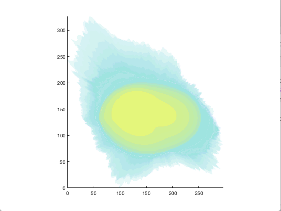
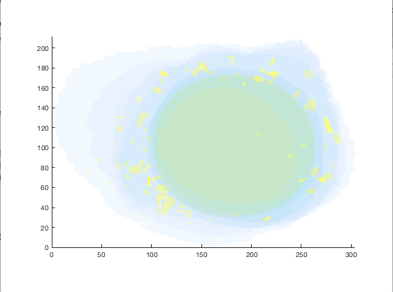
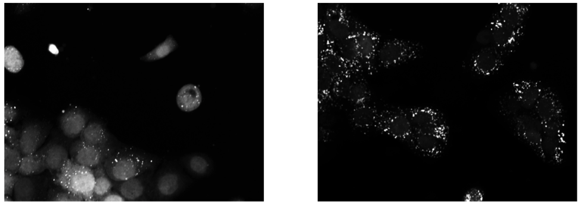
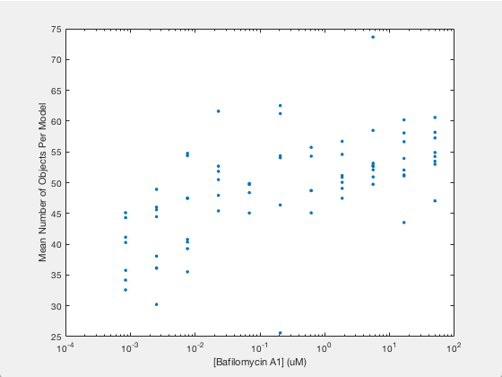

.. 45_minutes_tutorial:
.. include:: <isonum.txt>

CellOrganizer in 45 Minutes
***************************

Introduction
------------

CellOrganizer is a software package that learns generative models of cell organization from fluorescence images. These models are useful for modeling the dependency between compartments of the cell, allowing for a compact representation of cell geometries present in cell images and generating image of geometries useful for spatially realistic biochemical simulations. There are two main functions which this tutorial will cover: ``img2slml``, the top-level function to train a generative model of cell morphology, and ``slml2img``, the top-level function to generate an instance from a trained model.

Who is this tutorial for?
-------------------------

This tutorial is for people who have experience with fluorescence microscopy, no experience with CellOrganizer and possibly some experience with MATLAB, generative models, or cell modeling. Users should be interested in learning how to use the automated modeling tools provided by CellOrganizer to explore their image data.

Resources
---------

* `CellOrganizer <http://cellorganizer.org>`_

* `CellOrganizer Publications <http://www.cellorganizer.org/publications/>`_

Other Software
--------------

`ImageJ <http://imagej.nih.gov/ij/>`_ - This is great software for viewing your images and those synthesized from CellOrganizer. This tutorial uses ImageJ in some spots.

Image Databases
---------------

* `Cell Image Library <http://www.cellimagelibrary.org>`_
* `Human Protein Atlas <http://www.proteinatlas.org/subcellular>`_
* `Murphy Lab Public Datasets <http://murphylab.web.cmu.edu/data/>`_

Requirements
------------

* An OS X, Linux or Unix operating system
* MATLAB installation (MATLAB 2014a or newer) with the following toolboxes:
        * Bioinformatics Toolbox
        * Computer Vision System Toolbox
        * Control System Toolbox
        * Curve Fitting Toolbox
        * Image Processing Toolbox
        * Mapping Toolbox
        * Optimization Toolbox
        * Robust Control Toolbox
        * Signal Processing Toolbox
        * Simulink
        * Simulink Design Optimization
        * Statistics and Machine Learning Toolbox
        * System Identification Toolbox
        * Wavelet Toolbox
* Some basic familiarity with writing scripts/programming (preferably in MATLAB).

Input requirements for building models
--------------------------------------

The main function that builds a generative model is called ``img2slml``. This function has five input arguments

* dimensionality
* dna_membrane_images
* cell_membrane_images
* protein_channel_images
* options_structure

The first input argument ``dimensionality`` is a string, e.g. '2D', '3D', that specifies whether we are building a generative model by training on 2D or 3D images.

Each of the second to fourth input arguments can be provided in one of the following three formats

* a string containing wildcards, e.g. '/path/to/images/\*.tiff'
* a cell array of strings that point to each file, e.g. {'/path/to/images/1.tiff', '/path/to/images/2.tiff'}
* a cell array of function handles where each function returns a 2D/3D array that corresponds to a particular image in the list

The last input argument ``options_structure`` is a Matlab structure that contains the fields necessary for you to train the model in question.

In general, the images should

* be able to be read with `BioFormats for Matlab <https://docs.openmicroscopy.org/bio-formats/5.7.2/developers/matlab-dev.html>`_.
* contain only a single cell OR have a single cell region defined by additional mask image(s)
* contain channel(s) for fluorescent marker(s) appropriate for the desired type of model. Typically, one might include
	* a channel for nuclear shape (e.g. DAPI, Hoechst, tagged histone),
	* a channel for cell shape (e.g. a soluble cytoplasmic protein, a plasma membrane protein, or autofluorescence), and
	* a channel for a specific organelle (e.g. mitochondria, lysosome)

If your images are valid OME.TIFF files with regions of interest (ROI), then you can use the helper function ``get_list_of_function_handles_from_ometiff`` to retrieve a list of function handles. Each function handle should be able to return a 3D matrix when called using ``feval``. For example

.. gist:: https://gist.github.com/icaoberg/ee061a2d1bbe12ea5d05871f31364ef2

Hence we can use this helper function to generate input arguments for the function ``img2slml``. For example

.. gist:: https://gist.github.com/icaoberg/f327f6cd28ee448a2175460280ee4b44

Setup
-----

Download the most recent version of CellOrganizer
-------------------------------------------------
The most recent version of the CellOrganizer software (v2.9.0) can be found under the `Downloads <http://www.cellorganizer.org/cellorganizer-2-9-0/>`_ of the CellOrganizer homepage. Make sure to download the `distribution that includes the image collection <http://www.cellorganizer.org/Downloads/v2.9/cellorganizer-v2.9.0-images-collection.tgz>`_, since we will use these images soon.  After downloading the CellOrganizer source code, unzip the folder, and copy the resulting folder into the "Documents" → "MATLAB" directory.

Add the CellOrganizer directory to path
---------------------------------------
You should see the folder appear in the "Current Folder" in MATLAB on the left side.  If it doesn’t, make sure that your file path is set to "Users" → your user name → "Documents" → "MATLAB".

To ensure that MATLAB can access the images and files contained within the CellOrganizer folder, right click on "cellorganizer-v2.9.0" on the left side of the MATLAB window and select "Add to Path" → "Selected Folders and Subfolders".

Adding Images
-------------
Images included in the CellOrganizer download can be found in "Documents" → "MATLAB" → "cellorganizer-v2.9.0" → "images".

If you don't have your own images and did not download the full version of CellOrganizer in Step 0, then you can download some samples `here <http://murphylab.web.cmu.edu/data/Hela/3D/multitiff/3DHela_LAM.tgz>`_. (Note: The whole collection is 2.0 GB.) These are 3D HeLa images with a nuclear stain (channel 0), cell stain (channel 1) and protein stain (channel 2). The tagged protein is `LAMP2 <https://en.wikipedia.org/wiki/LAMP2>`_, a lysosomal protein.

(optional) Training time can be decreased by reducing the number of images to be reviewed. This can be done by either removing images from the collection or changing the directory address to a specific range of images within the collection.

Training Models
---------------
``img2slml.m``, contained in the main folder, is the primary function used in training a model from cellular images. It takes 5 inputs:

* a flag describing the dimensionality of the data (i.e. 2D or 3D; this tutorial describes only 3D functionality),
* images for the nuclear channel,
* images for the cell shape channel,
* images for the protein channel (optional) and
* options used to change various model settings.

The training portion of this tutorial covers the very basic setup required to get ``img2slml`` up and running.

**Start a new "scratch" script**
Click "New" → "New Script", and save your file as ``tutorial_train.m`` (make sure that the file is saved to the "Documents" → "MATLAB" path, but not inside the “cellorganizer-v2.9.0” folder). Instead of typing the commands in the following sections into the Command Window, type (or copy and paste) them into ``tutorial_train.m``. This will keep track of what you have done so far and provide a resource for later use.

**Create variables containing your images**
We next need to tell CellOrganizer which cellular images we would like to use. To make life easier in the future, let's start by defining a variable that contains the path to the directory where our images for the project are going to be stored.  You can find processed (there are cell masks provided that indicate the position of the cell in each image) 3D images for HeLa cells in the path below, which we will rename as ``img__dir``::

	img_dir = './cellorganizer-v2.9.0/images/HeLa/3D/processed';

We would like to select just the "LAM" image files found within this folder in order to train our model.  There are three ways to do this depending on how you have stored your images, each of which has its strengths: a string of wildcards, a cell array of file paths, and a cell array of function handles.

**String wild-cards**. If your files are named in some basic pattern (as the LAM files are), then wildcards are the easiest way to get your file information into CellOrganizer. All of the LAM files have the format "LAM_cellX_chY_t1.tif", where "X" is the image number of the image number (ranging from 1-50) and "Y" is the channel number (0, 1, or 2 based on nuclear, cell, and protein channels). We can split the images by channel number and to create an array of image names for each channel using the wildcard "*" as follows (where "*" indicates "any character")::

	nuc_img_paths = [img_dir '/LAM_cell*_ch0_t1.tif'];
	cell_img_paths = [img_dir '/LAM_cell*_ch1_t1.tif'];
	prot_img_paths = [img_dir '/LAM_cell*_ch2_t1.tif'];

**Option 2 (Advanced)**

*Cell-array of string paths*. Alternatively, you can store the images as individual paths in a cell array. Since there are 50 images, we will loop through the directory and store each name in an element of a cell array. There are more "programmatically correct" ways to do this, but this is the most direct way. To iterate over the 50 images::

  nuc_img_paths = cell(50, 1);
  cell_img_paths = cell(50, 1);
  prot_img_paths = cell(50, 1);
  for i = 1:50
    nuc_img_paths{i} = [img_dir '/LAM_cell' num2str(i) '_ch0_t1.tif'];
		cell_img_paths{i} = [img_dir '/LAM_cell' num2str(i) '_ch1_t1.tif'];
		prot_img_paths{i} = [img_dir '/LAM_cell' num2str(i) '_ch2_t1.tif'];
	end

**Option 3 (Even more advanced)**

*Function handles*. If you're very comfortable with MATLAB, you can pass a cell-array of anonymous function handles as your images into CellOrganizer. If the previous sentence doesn't make any sense to you, it's probably best that you skip this part of the tutorial. An example of using function handles would be::

	nuc_img_paths = cell(50, 1);
	cell_img_paths = cell(50, 1);
	prot_img_paths = cell(50, 1);
	for i = 1:50
  	nuc_img_paths{i} = @() ml_readimage([img_dir '/LAM_cell' num2str(i) '_ch0_t1.tif']);
  	cell_img_paths{i} = @() ml_readimage([img_dir '/LAM_cell' num2str(i) '_ch1_t1.tif']);
  	prot_img_paths{i} = @() ml_readimage([img_dir '/LAM_cell' num2str(i) '_ch2_t1.tif']);
	end

Here we're using the CellOrganizer provided function ``ml_readimage`` to read in and return the actual image matrix, but any function that returns the actual image matrix of data will work.

**Set up the options structure**
The options structure tells CellOrganizer how you want to build a model, and allows for option input. Most of the options have default values, so we don't have to set them manually for this tutorial. However, we do need to provide a pixel resolution fpr creating the images and a filename for saving the resulting model. To define the appropriate options, we create a struct variable called ``train_options`` and set its fields accordingly::

	% this is the pixel resolution in um of the images
	train_options.model.resolution = [0.049, 0.049, 0.2000];

	% this tells CellOrganizer what channels to build models for
	train_options.train.flag = 'all';

	% this is the filename to be used to save the model in
	train_options.model.filename = 'model.mat';

The option ``train_options.model.filename`` defines where the .mat file containing the resulting model should be saved. By setting ``train_options.train.flag`` to ``'all'`` we specify that we want CellOrganizer to train a nuclear shape, cell shape and protein distribution model. We can also specify the train flag as ``'framework'`` to train just a nuclear shape and cell shape model (and we would therefore no longer need to provide protein images), or set the flag to ``'nuc'`` and just train a nuclear shape model (and not have to provide either cell shape images or protein images).

So far we have the bare *minimum* requirements for setting up a model. We will set one more option to speed up the tutorial::

	train_options.model.downsampling = [5,5,1];

This downsamples our input images by 5 in the x- and y-dimensions, decreasing the memory used for the tutorial.

**Add model types and classes**
In addition to specifying which models (e.g. nuclear shape, cell shape, protein distribution) we want to train, we also need to specify the type and class for each model.  We do this by adding additional lines to the options structure::

	train_options.nucleus.type = 'cylindrical_surface';
  train_options.nucleus.class = 'nuclear_membrane';

	train_options.cell.type = 'ratio';
  train_options.cell.class = 'cell_membrane';

	train_options.protein.type = 'gmm';
  train_options.protein.class = 'vesicle';

	train_options.debug = true;

Now that we have everything together, we can train the model::

	img2slml('3D', nuc_img_paths, cell_img_paths, prot_img_paths, train_options);

If your model building options don't require one or more of the image types (e.g. protein images are not required if ``train_options.train_flag`` is set to ``'framework'``), you can just use empty brackets in place of the arguments::

	img2slml('3D', nuc_img_paths, cell_img_paths, [], train_options);

(Note: make sure that your inputs to ``img2slml`` correspond to your setting of ``train.flag``)

**Run your training script**
Press the run button on the top of the MATLAB window or type the name of your script into the Command Window. If you used a lot of images or did not aggressively downsample your images it may take some time to run.

**Analyzing your trained model**
After your script has finished running in CellOrganizer without error, you should have a .mat file named model.mat in the directory in which you ran the code. Congratulations, you made it! If you load that file into your workspace, you'll see that this is another struct with fields. This is the model of your cell images. You'll notice that it's a lot smaller in file size than the collection of source images you used to train it. Take some time to explore these fields.

Synthesizing an Image from a Model
----------------------------------

We will next describe how to synthesize a cell shape in CellOrganizer. The main function here is ``slml2img.m``. It takes two inputs

* a cell array of paths to the models from which we want to synthesize an image
* a list of options used to change various synthesis settings

**Start a new "scratch" script**
First, we create a new script and call it ``tutorial_synthesis.m``.

**Set up the model and option inputs**
Start by defining two variables: a cell-array containing the path to the model you created in the **Training** section, and a new options structure (different from the one used for training). If you followed the instructions in the **Training** section, then you can generate images from the model you trained earlier::

	model_path = {'model.mat'};

Alternatively, you can generate images from one of the models provided in the CellOrganizer distribution, such as the model of the lysosomal protein LAMP2 in HeLa cells::

	model_path = {'./cellorganizer-v2.9.0/models/3D/lamp2.mat'};

The options structure for synthesis is set up in a similar way to how we set up the options structure in **Training**. Here we create a new struct called ``synth_options`` and specify where we want the images to be saved, a prefix for the saved files, and the number of images desired::

	%save into the current directory
	synth_options.targetDirectory = './';

	synth_options.prefix = 'synthesis_tutorial';

	%generate two images
	synth_options.numberOfSynthesizedImages = 2;

**Controlling the random seed (optional)**
CellOrganizer generates synthetic images by randomly drawing parameter values from the distributions contained in the specified model.  In the process of synthesis, CellOrganizer depends on psuedo-random numbers that are generated by the MATLAB ``rand`` function. For the purposes of reproducability, the sequence of pseudo-random numbers passed into CellOrganizer can be replicated by initializing the *random* seed (using the ``rng`` function) to the same number each time before running ``slml2img``::

	rng(666);

If we do this, the sequence of images that CellOrganizer synthesizes will be the same each time our script is run.  If we do not, we may get different images each time we run the script.

Now that we have everything set up, we can generate an image or two!

**Run your synthesis script**
As in the last line of our script, we call ``slml2img.m`` with the options structure we defined::

	slml2img(model_path, synth_options);

Save your file and run it. This may take a while, especially if you have decided to generate many images.

**Analyze your synthesized images**
After the image generation is complete, you can view them. In the current directory you should see a folder named "synthesis_tutorial", which should contain two directories, “cell1” and “cell2”, each of which contain images corresponding to each channel drawn from the model you trained in the **Training** section. While these images can be opened in ImageJ, we are going to demonstrate two useful tools in CellOrganizer that we frequently use to explore our synthesized images.

First we're going to create an *indexed image* by combining the output images::

	%read in each image to a variable
	im_cell = ml_readimage('<path to cell image>');
	im_dna = ml_readimage('<path to nucleus image>');
	im_prot = ml_readimage('<path to protein image>');

	%create an empty image
	im_indexed = zeros(size(im_cell));

	%Set the cell shape, nuclear shape and protein shape values to 1,2,3 respectively
	im_indexed(im_cell>0) = 1;
	im_indexed(im_dna>0) = 2;
	im_imdexed(im_prot>0) = 3;

Now that we have an *indexed image*, we can view it with the function ``img2vol`` (after downsampling it by a factor of two in X, Y and Z::

	figure = img2vol(ml_downsize(im_indexed, [2,2,2]));

        Visualization of cell1 synthesized from the model trained in the **Training** section

        Visualization of cell1 synthesized from './cellorganizer-v2.9.0/models/3D/lamp2.mat'

Congratulations! You have created a synthetic cell!

Visualizing Model Results
-------------------------
Although generating synthetic cell shapes is fun (and useful for doing cell simulations), the real power of CellOrganizer lies in its ability to describe distributions of cell geometries and the organization of components within them. Here we will demonstrate how to use CellOrganizer to generate some interesting analysis results.

**Background**
Upon exposure to Bafilomycin A1, microtubule-associated protein light chain 3 (LC3) localizes into autophagosomes for degradation and forms punctate structures.

   Images of eGFP-LC3 tagged RT112 cells at 40x under normal conditions (left) and in a 50uM Bafilomycin condition (right).

Let’s say we are curious as to how the number of autophagosomes changes with Bafilomycin concentration. Given a collection of images under different concentrations we can segment out the cell shapes and train a model for the cells contained in each image. It just so happens that we have already done that, and the models and associated drug concentrations, can be found `here <https://cmu.app.box.com/s/6xybp3nnaxcovvtkifhexgcgoog51slz>`_.

The .mat file has two variables saved in it. One is a list of drug micromolar concentrations, and the other is a list of models trained with images of cells at those concentrations (like the above two images). For each model, we're going to plot the number of autophagosomes versus the Bafilomycin concentration.

**Start another "scratch" script**
Lets call this one ``plotObjsByModel.m``

**Load the model data into the workspace**
Load the .mat file you downloaded into the Workspace by double clicking on it. You should see two variables, ``conc``, and ``models``. These are the variables that contain the drug concentrations and trained CellOrganizer models of cells exposed to Bafilomycin at those concentrations. You can access the first model by typing ``models{1}``, the second model by ``models{2}`` and so on. You will see that there are a lot of components to these models, but we're just interested in the number of objects under each condition.

**Plot the average number of autophagosomes for each model**
We must access the component of the model that contains the distribution for the number of objects. We can access that in the first model with::

	models{1}.proteinModel.objectModel.numStatModel

The output should be::

	ans =

    	name: 'gamma'
    	alpha: 2.7464
    	beta: 19.291

This means that the distribution over the number of objects contained in the cells that were used to train this model is modeled as a `gamma distribution <https://en.wikipedia.org/wiki/Gamma_distribution>`_ with two parameters, alpha, and beta. It just so happens that the mean of a gamma distribution is the product of these two parameters. Let’s write a loop to get the average number of autophagosomes from each model::

	for i = 1:length(models)
		numObjsModel = models{i}.proteinModel.objectModel.numStatModel;
		avgObjects(i) = numObjsModel.alpha*numObjsModel.beta;
	end

Now we simply plot the number of objects versus the drug concentration. Here we will use a semilog plot to make visualization easier::

	semilogx(conc, avgObjects, 'linestyle', 'none', 'marker', '.', 'markersize', 10)
	ylabel('Mean Number of Objects Per Model')
	xlabel('[Bafilomycin A1] (uM)')

