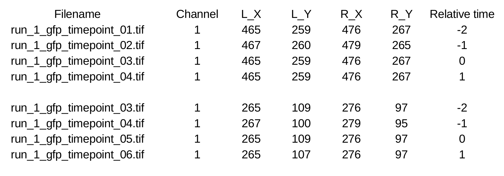

T cell models
-------------

Overview
~~~~~~~~

The T Cell model is a building model for 3D cells with protein patterns, and can be used to develop 4D movies. The model is based on the T cell model in Royal et al. 2016.
We assume different cells have similar cell shape and can be mapped to a template.  This lends the model to be useful for quantitative analysis of proteins in T cells, as well as other cells. Similar to other models in CellOrganizer, there are two parts: training and synthesis. In training, a morphing model is trained from the original images. In synthesis, images of cells are synthesized from the trained model and include the protein pattern.

We have a protocol chapter that describes how the images are generated, annotated and analysized:

* Ambler, R., Ruan, X., Murphy, R. F. and Wülfing, C., 2017. `Systems Imaging of the Immune Synapse <https://link.springer.com/protocol/10.1007/978-1-4939-6881-7_25>`_. The Immune Synapse: Methods and Protocols, pp.409-421.

The usage of the model is part of the chapter (section 3.7 & 3.8)

Training
~~~~~~~~
The training part requries T cell movies and the annotation of the synapse positions of the T cells as input. It can be further broken down into the following steps: cropping, segmentation, rigid alignment, non-rigid alignment (morphing) and model-building. 

The training demo included, demo3Dtcell_train, trains a protein distribution model following the approach described in

* K. T. Roybal, T. E. Buck, X. Ruan, B. H. Cho, D. J. Clark, R. Ambler, H. M. Tunbridge, J. Zhang, P. Verkade, C. Wülfing, and R. F. Murphy (2016) `Computational spatiotemporal analysis identifies WAVE2 and Cofilin as joint regulators of costimulation-mediated T cell actin dynamics <http://stke.sciencemag.org/content/9/424/rs3>`_. Science Signaling 9:rs3. doi: 10.1126/scisignal.aad4149.

The slowest step, which takes approximately 1 min per cell per frame, is the alignment of each cell to the standardized template. This demo uses 46 cells, so it will run for about an 1 hour on a single core.

Synthesis
~~~~~~~~~
In the synthesis part, a T cell model is required as input. Should there be a specified shape to the cells, then a cell shape model is also required. The synthesis can be further broken down into the following steps: voxel sampling, shape registration, and voxel mapping. 

The synthesis demo included, demo3Dtcell_synth, sythesizes from a T cell model. The demo takes in two models, one model containing the cell and nuclear shape models, and the other containing a T cell protein shape model.

Annotation File
~~~~~~~~~~~~~~~

Each annotation file contains the information of chosen cell pairs for a movie (each frame is a 3D stack). An example annotation file is shown below. The annotation file should be formated as described below:

* Each row represents a cell in a specific time point. And the adjacent rows without blank row separation represents a cell in different time points. Different cells are separated with blank row(s). 
* In column 1, the name of the image file (depending on how the images are acquired, there may be one file per time point or multiple time points in a single file).
* In column 2, the number of the channel within that file that contains the GFP fluorescence for that time point (if each time point is in a separate file, this would typically be channel 1; if multiple time points are in the same file, this would typically be the frame number).
* In columns 3–7, the X coordinate of the left end point, the Y coordinate of the left end point, the X coordinate of the right end point, and the Y coordinate of the right end point for the synapse in that time point.
* In column 8, the time difference for that frame relative to time point 0.

