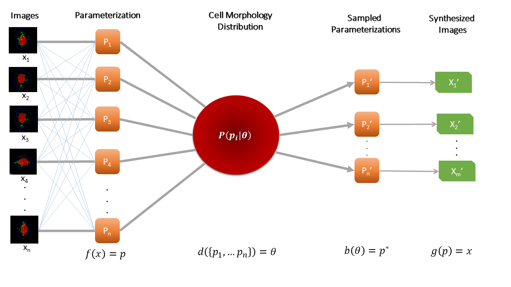

CellOrganizer is an open source system for using microscope images to learn statistical models of the structure of cell components and of how those components are organized relative to each other.

Since these models can be used to synthesize new images reflecting what the model learned, they are referred to as *generative* models.

For example, CellOrganizer can take fluorescence microscope images of many cells expressing a GFP-tagged lysosomal protein and construct a model of how the cell and nuclear shapes vary among those cells, how many lysosomes are typically found per cell, how they vary in size, and where they are typically located relative to the cell and nuclear boundaries.

Publications describing the development and use of various software components of CellOrganizer are located `here <http://cellorganizer.org/Publications>`_.
A recent overview of the principles behind CellOrganizer can be found `here <http://www.sciencedirect.com/science/article/pii/S1046202315301298>`_.  And to download the most recent version of CellOrganizer, please visit our download `page <http://www.cellorganizer.org/cellorganizer-2-9-0//>`_.

CellOrganizer provides tools for

* learning generative models of cell organization directly from images;
* storing and retrieving those models;
* synthesizing cell images (or other representations) from one or more models.

Model learning captures variation among cells in a collection of images. Images used for model learning and instances synthesized from models can be two- or three-dimensional static images or movies.

CellOrganizer learns compact and invertible models of subcellular shape and organization. To train a model for a collection of images, CellOrganizer first finds the parameterizations per image, then learns a distribution on these parameterizations and stores it in the trained model. Parameterizations can be sampled from this distribution and then be used to synthesize novel images. Johnson (2015). "Model Selection in Parameterizing Cell Images and Populations."

CellOrganizer can learn models of

* cell shape;
* nuclear shape;
* chromatin texture;
* vesicular organelle size, shape and position;
* microtubule distribution. 

**Supported model classes and types**

This table lists all supported model classes and types in this version of CellOrganizer

+---------+----------------------+---------------------------------+----------------------------------+---------------------------------+
| 2D/3D   | Model Class          | Model Type                      | Depends on                       | Produces                        |
+=========+======================+=================================+==================================+=================================+
| 2D      | vesicle              | gmm                             | nuclear_membrane & cell_membrane | vesicle                         |
+---------+----------------------+---------------------------------+----------------------------------+---------------------------------+
| 2D      | nuclear_membrane     | medial_axis                     | N/A                              | nuclear_membrane                |
+---------+----------------------+---------------------------------+----------------------------------+---------------------------------+
| 2D      | framework            | pca                             | N/A                              | cell_membrane, nuclear_membrane |
+---------+----------------------+---------------------------------+----------------------------------+---------------------------------+
| 2D      | cell_membrane        | ratio                           | nuclear_membrane                 | cell_membrane                   |
+---------+----------------------+---------------------------------+----------------------------------+---------------------------------+
| 3D      | vesicle              | gmm                             | nuclear_membrane & cell_membrane | vesicle                         |
+---------+----------------------+---------------------------------+----------------------------------+---------------------------------+
| 3D      | nuclear_membrane     | cylindrical_surface             | N/A                              | nuclear_membrane                |
+---------+----------------------+---------------------------------+----------------------------------+---------------------------------+
| 3D      | cell_membrane        | ratio                           | nuclear_membrane                 | cell_membrane                   |
+---------+----------------------+---------------------------------+----------------------------------+---------------------------------+
| 2D      | framework            | diffeomorphic                   | N/A                              | cell_membrane, nuclear_membrane |
+---------+----------------------+---------------------------------+----------------------------------+---------------------------------+
| 3D      | framework            | diffeomorphic                   | N/A                              | cell_membrane, nuclear_membrane |
+---------+----------------------+---------------------------------+----------------------------------+---------------------------------+
| 3D      | network              | microtubule_growth              | nuclear_membrane & cell_membrane | microtubule                     |
+---------+----------------------+---------------------------------+----------------------------------+---------------------------------+
| 3D      | protein_distribution | morphing                        | N/A                              | protein spatial distribution    |
+---------+----------------------+---------------------------------+----------------------------------+---------------------------------+
| 3D      | standardized_voxels  | standardized_map_half-ellipsoid | N/A                              | N/A                             |
+---------+----------------------+---------------------------------+----------------------------------+---------------------------------+
| 3D      | csgo                 | half-ellipsoid                  | N/A                              | N/A                             |
+---------+----------------------+---------------------------------+----------------------------------+---------------------------------+
| 3D      | framework            | SPHARM                          | N/A                              | cell membrane, nuclear membrane |
+---------+----------------------+---------------------------------+----------------------------------+---------------------------------+

These models can be conditional upon each other. For example, for a given synthesized cell instance, organelle position is dependent upon the cell and nuclear shape of that instance.
Cell types for which generative models of at least some type of organelle have been built include human HeLa cells, mouse NIH 3T3 cells, and Arabidopsis protoplasts. Planned projects include mouse T lymphocytes and rat PC12 cells.

**Support for CellOrganizer has been provided by grants GM075205, GM090033 and GM103712 from the** `National Institute of General Medical Sciences <https://www.nigms.nih.gov/Pages/default.aspx>`_, **grants MCB1121919 and MCB1121793 from the U.S.** `National Science Foundation <https://www.nsf.gov/>`_, **by a Forschungspreis from the** `Alexander von Humboldt Foundation <https://www.humboldt-foundation.de/web/home.html>`_, **and by the** `Freiburg Institute for Advanced Studies <https://www.frias.uni-freiburg.de/en/home>`_.

